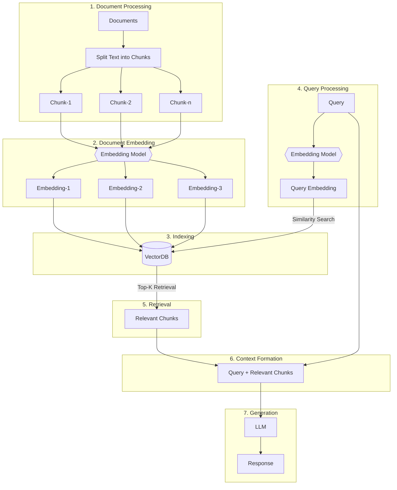

# RAG from Scratch




## Overview

This guide walks you through creating a simple Retrieval-Augmented Generation (RAG) system using pure Python. We will use an embedding model and a language model (LLM) to retrieve relevant documents and generate responses based on a user's query.

## Steps Involved

The whole process can be factored into two big steps:

1. **Knowledge Base Creation**
2. **Generation Part**

### Knowledge Base Creation

To get started, you'll first need a knowledge base (documents, PDFs, wiki pages). This is the fodder for your language models (LLMs). The process involves:

- **Chunking**: Split the text into chunks of sub-documents to simplify ingestion.
- **Embedding**: Compute numerical embeddings for each chunk to understand the semantic similarity to queries.
- **Storage**: Store the embeddings in a way that allows quick retrieval. While a vector store/DB is often used, this tutorial shows that it's not essential.

### Generation

When a user query comes in, an embedding is computed for the query, and we retrieve the most relevant chunks from the knowledge base. These relevant chunks are appended to the initial user query, forming a context that is fed into the LLM to generate a response.

## 1. The Setup

A bunch of packages that need to be installed before we get going.

- **`sentence-transformers`**: For embedding the documents and queries.
- **`numpy`**: For similarity comparisons.
- **`scipy`**: For advanced similarity computations.
- **`wikipedia-api`**: For loading a Wikipedia page as a knowledge base.
- **`textwrap`**: For formatting output text.

```python
!pip install -q sentence-transformers
!pip install -q wikipedia-api
!pip install -q numpy
!pip install -q scipy
```

## 2. Loading the Embedding Model

Let's load the embedding model of our choice. In this tutorial, we are using the `gte-base-en-v1.5`.

```python
from sentence_transformers import SentenceTransformer
model = SentenceTransformer("Alibaba-NLP/gte-base-en-v1.5", trust_remote_code=True)
```

### About the Model

The `gte-base-en-v1.5` model is an open-source English model provided by Alibaba's NLP team. It is part of the GTE (General Text Embeddings) family, designed for generating high-quality embeddings suitable for various natural language processing tasks. The model is optimized for capturing semantic meaning in English text, making it useful for tasks like sentence similarity, semantic search, and clustering. The `trust_remote_code=True` parameter allows the use of custom code associated with the model, ensuring that it functions as intended.

## 3. Fetch Text Content from Wikipedia and Prepare It

- Start by loading a Wikipedia article as your knowledge base. The text will be split into manageable chunks (sub-documents), usually by paragraphs.

  ```python
  from wikipediaapi import Wikipedia
  wiki = Wikipedia('RAGBot/0.0', 'en')
  doc = wiki.page('Hayao_Miyazaki').text
  paragraphs = doc.split('\n\n')  # chunking
  ```

- While there are a ton of chunking strategies available, many of them don't work as expected. It's best to review your knowledge base (KB) and determine which strategy suits it best. In this case, we'll chunk the document based on paragraphs.

- If you want to view how these chunks look, import the `textwrap` library, and enumerate over each paragraph to print them.

  ```python
  import textwrap

  for i, p in enumerate(paragraphs):
      wrapped_text = textwrap.fill(p, width=100)

      print("-----------------------------------------------------------------")
      print(wrapped_text)
      print("-----------------------------------------------------------------")
  ```

- If your document contains images and tables, it is recommended to extract them separately and embed them using vision models.

## 4. Embed the Document

- Next, encode the text data (in this case, the `paragraphs`) into embeddings by calling the `encode` method on our model.

  ```python
  docs_embed = model.encode(paragraphs, normalize_embeddings=True)
  ```

- These embeddings are dense vector representations of text that capture semantic meaning, allowing the model to understand and process text in a mathematical form.

- We are normalizing the embeddings here.

  - **What is normalization?** It's a process that adjusts the values of the embeddings to have a unit norm (i.e., the length of the vector is 1).

  - **Why normalize?** Normalized embeddings ensure that the distance between vectors is primarily due to differences in direction rather than magnitude. This can improve the performance of models in tasks like similarity search, where you want to compare how "close" or "similar" different pieces of text are.

- The result, `docs_embed`, is a collection of vector representations of your text data, where each vector corresponds to a paragraph in the `paragraphs` list.

- The `shape` command gives the number of chunks and the dimension of each embedded vector. (Note that the size of the embedding vector depends on the type of embedding model.)

  ```python
  docs_embed.shape
  ```

- You can then view how the actual embeddings look, which is an array of normalized numbers.

  ```python
  docs_embed[0]
  ```

## 5. Embed the Query

Let's embed a sample user query in a similar fashion to how we embedded the document.

```python
query = "What was Studio Ghibli's first film?"
query_embed = model.encode(query, normalize_embeddings=True)
```

You can check the shape of the query_embed to confirm the dimensions of the embedded query.

```python
query_embed.shape
```

## 6. Finding the Closest Paragraphs to the Query

One of the simplest ways to retrive of the most relevant chunks would be to compute the dot product of your document embedding and the query embedding.

### a. Taking dot product

The dot product is a mathematical operation that multiplies corresponding elements of two vectors (or matrices) and sums the results. It is commonly used to measure the similarity between two vectors.

(Notice that the transpose of the `query_embed` vector is taken for computing the dot product).

```python
import numpy as np
similarities = np.dot(docs_embed, query_embed.T)
```

### b. Understanding the Dot Product and the Shape

The .shape attribute of a NumPy array returns a tuple representing the dimensions of the array.

```python
similarities.shape
```

The expected shape in this code would be:

- If docs_embed has a shape of (n_docs, n_dim):

  - n_docs is the number of documents.
  - n_dim is the dimensionality of each document embedding.

- query_embed.T would have a shape of (n_dim, 1) since we are comparing against a single query.

- The resulting similarities array, after the dot product, will have a shape of (n_docs,), meaning it’s a 1-dimensional array (a vector) with n_docs elements. Each element represents the similarity score between the query and one of the documents.

- **Why Check the Shape?** Ensuring that the shape is as expected (n_docs,) confirms that the dot product was performed correctly and that each document’s similarity score was computed.

You can print the `similarities` array to inspect the similarity scores, where each value corresponds to a dot product result:

```python
print(similarities)
```

### c. Dot Product Interpretation

The dot product between two vectors (embeddings) measures their similarity:
Higher values indicate greater similarity between the query and the document.
If the embeddings are normalized, these values are directly proportional to the cosine similarity between the vectors.
If not normalized, they still indicate similarity, but also reflect the magnitudes of the embeddings.

### d. Identifying the Top 3 Most Similar Documents

To identify the top 3 most similar documents based on the similarity scores, you can use the following code:

```python
top_3_idx = np.argsort(similarities, axis=0)[-3:][::-1].tolist()
```

- **np.argsort(similarities, axis=0):** This function sorts the indices of the similarities array in ascending order. For example, if similarities = [0.1, 0.7, 0.4], np.argsort would return [0, 2, 1], where 0 is the index of the smallest value and 1 is the index of the largest value.

- **[-3:]:** This slice operation selects the indices of the top 3 highest similarity scores (the last 3 elements after sorting).

- **[::-1]:** This reverses the order, so the indices are now in descending order of similarity.

- **tolist():** Converts the array of indices into a Python list.
  Result: top_3_idx contains the indices of the top 3 most similar documents, in order of descending similarity.

### e. Extracting the Most Similar Documents

```python
most_similar_documents = [paragraphs[idx] for idx in top_3_idx]
```

- **List Comprehension:** This line creates a list called most_similar_documents, which contains the actual paragraphs from the paragraphs list that correspond to the indices in top_3_idx.
- **paragraphs[idx]:** For each index in top_3_idx, this retrieves the corresponding paragraph.

### f. Formatting and Displaying the Most Similar Documents

The CONTEXT variable is initially initialized as an empty string and will later be appended with the wrapped text of the most similar documents in an enumerate loop.

```python
CONTEXT = ""
for i, p in enumerate(most_similar_documents):
  wrapped_text = textwrap.fill(p, width=100)

  print("-----------------------------------------------------------------")
  print(wrapped_text)
  print("-----------------------------------------------------------------")
  CONTEXT += wrapped_text + "\n\n"
```

## 7. Generating a Response

So, now we have a query + relevant chunks, which together will be fed to the LLM.

### a. Declare a Query

```python
query = "What was Studio Ghibli's first film?"
```

### b. Create a Prompt

```python
prompt = f"""
use the following CONTEXT to answer the QUESTION at the end.
If you don't know the answer, just say that you don't know, don't try to make up an answer.

CONTEXT: {CONTEXT}
QUESTION: {query}

"""
```

### c. Set up OpenAI

- Install OpenAI to access and use LLMs.

  ```python
  !pip install -q openai
  ```

- Enable access to the OpenAI API key (can be set up in secrets on Google Colab).

  ```python
  from google.colab import userdata
  userdata.get('openai')

  import openai
  ```

- Create an OpenAI client.

  ```python
  from openai import OpenAI
  client = OpenAI(api_key=userdata.get('openai'))
  ```

### d. Make a API call to generate a response

```python
response = client.chat.completions.create(
  model="gpt-4o",
  messages=[
    {"role": "user", "content": prompt},
  ]
)
```

- **client.chat.completions.create:**
  This is a method call to create a new completion (response) using a chat-based language model.

- **client:** Represents the API client object connected to the service (here, OpenAI).

- **chat.completions.create:** Specifies that you're making a request to create a chat-based completion.

#### More about the parameters passed to the method

- **model="gpt-4o":**
  Specifies the model you want to use to generate the response.
  "gpt-4o" refers to a specific variant of the GPT-4 model. Different models can have different behaviors, fine-tuning, or capabilities, so specifying the model is important to ensure you get the desired output.

- **messages:**
  This parameter is a list of message objects that represent the conversation history. It allows the model to understand the context of the chat.
  In this case, we're providing only one message in the list: `{"role": "user", "content": prompt}`
- **role:**
  "user" indicates the role of the message sender, who is interacting with the model.

- **content:**
  This contains the actual text of the message sent by the user. The variable prompt holds this text, which the model will use as input to generate a response.

### e. About the response recieved

When you make a request to an API like OpenAI's GPT models to generate a chat completion, the response usually comes back in a structured format, often as a dictionary.

This structure typically includes:

- **choices:** A list (array) containing different possible completions generated by the model. Each item in this list represents one possible completion or response.
- **message:** An object or dictionary within each choice that contains the actual content of the message generated by the model.
- **content:** The text content of the message, which is the actual response or completion generated by the model.

### f. Printing the response

```python
print(response.choices[0].message.content)
```

We select the first item in the choices list, then access the messages object within it. Finally we access the content field within the message, which contains the actual text generated by the model.

## Conclusion

And that brings us to an end on building a RAG system from scratch. It's highly recommended to build your intial RAG setup in pure Python to get a better understanding of how these systems work.
