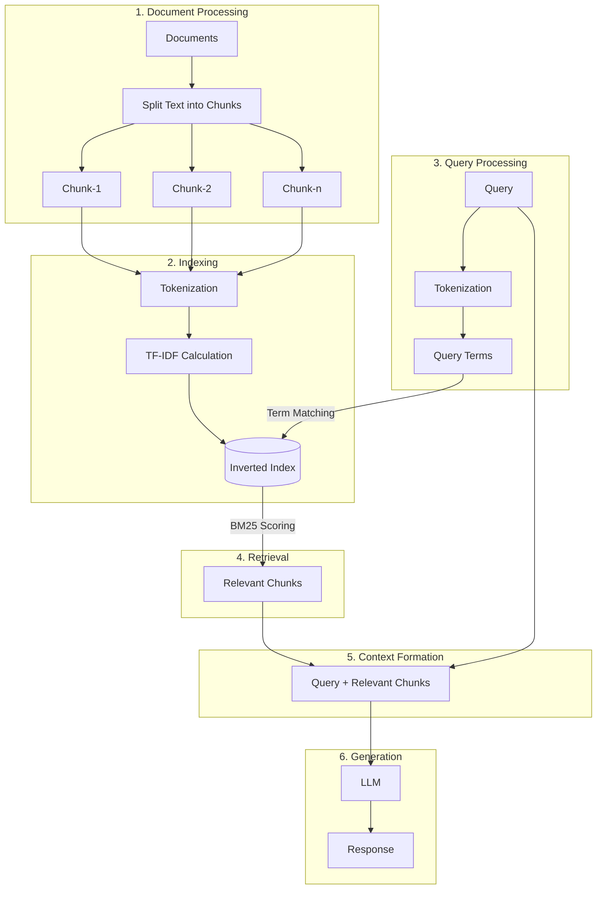

# BM25 RAG (Retrieval-Augmented Generation)

<div align="center">
<a href="https://aiengineering.academy/" target="_blank">

</a>
</div>

<div align="center">

[](https://github.com/adithya-s-k/AI-Engineering.academy/stargazers)
[](https://github.com/adithya-s-k/AI-Engineering.academy/network/members)
[](https://github.com/adithya-s-k/AI-Engineering.academy/issues)
[](https://github.com/adithya-s-k/AI-Engineering.academy/pulls)
[](https://github.com/adithya-s-k/AI-Engineering.academy/blob/main/LICENSE)

</div>

## Introduction

BM25 Retrieval-Augmented Generation (BM25 RAG) is an advanced technique that combines the power of the BM25 (Best Matching 25) algorithm for information retrieval with large language models for text generation. This approach enhances the accuracy and relevance of generated responses by grounding them in specific, retrieved information using a proven probabilistic retrieval model.

## BM25 RAG Workflow


## Getting Started

### Notebook
You can run the Jupyter notebook provided in this repository to explore BM25 RAG in detail.

### Chat Application
1. Install dependencies:
   ```
   pip install -r requirements.txt
   ```
2. Run the application:
   ```
   python app.py
   ```
3. To ingest data on the go:
   ```
   python app.py --ingest --data_dir /path/to/documents
   ```

### Server
Run the server with:
```
python server.py
```

The server has two endpoints:
- `/api/ingest`: For ingesting new documents
- `/api/query`: For querying the BM25 RAG system

## Key Features of BM25 RAG

1. **Probabilistic Retrieval**: BM25 uses a probabilistic model to rank documents, providing a theoretically sound basis for retrieval.
2. **Term Frequency Saturation**: BM25 accounts for diminishing returns from repeated terms, improving retrieval quality.
3. **Document Length Normalization**: The algorithm considers document length, reducing bias towards longer documents.
4. **Contextual Relevance**: By grounding responses in retrieved information, BM25 RAG produces more accurate and relevant answers.
5. **Scalability**: The BM25 retrieval step can handle large document collections efficiently.

## Benefits of BM25 RAG

1. **Improved Accuracy**: Combines the strengths of probabilistic retrieval and neural text generation.
2. **Interpretability**: BM25 scoring provides a more interpretable retrieval process compared to dense vector retrieval methods.
3. **Handling Long-tail Queries**: Particularly effective for queries requiring specific or rare information.
4. **No Embedding Required**: Unlike vector-based RAG, BM25 doesn't require document embeddings, reducing computational overhead.

## Prerequisites

- Python 3.7+
- Jupyter Notebook or JupyterLab (for running the notebook)
- Required Python packages (see `requirements.txt`)
- API key for the chosen Language Model (e.g., OpenAI API key)

## Contributing

We welcome contributions! Please see our [Contributing Guidelines](CONTRIBUTING.md) for more details.

## License

This project is licensed under the [MIT License](LICENSE).

## Acknowledgments

- [AI Engineering Academy](https://aiengineering.academy/) for supporting this project
- All contributors and community members

For more information, visit [AI Engineering Academy](https://aiengineering.academy/).