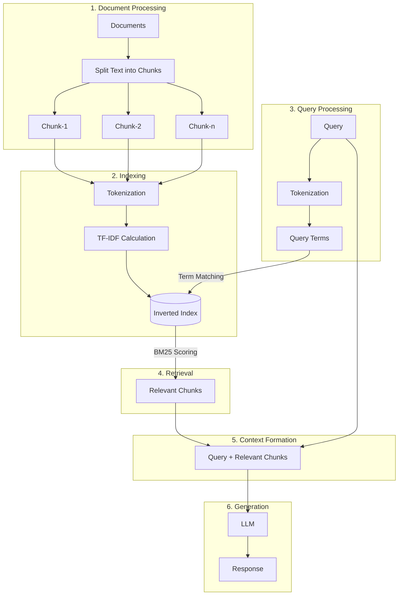

```mermaid
flowchart TD
    subgraph "1. Document Processing"
        A[Documents] --> B[Split Text into Chunks]
        B --> C1[Chunk-1]
        B --> C2[Chunk-2]
        B --> C3[Chunk-n]
    end
    
    subgraph "2. Indexing"
        C1 & C2 & C3 --> D[Tokenization]
        D --> E[TF-IDF Calculation]
        E --> F[(Inverted Index)]
    end
    
    subgraph "3. Query Processing"
        G[Query] --> H[Tokenization]
        H --> I[Query Terms]
    end
    
    subgraph "4. Retrieval"
        I -->|Term Matching| F
        F -->|BM25 Scoring| J[Relevant Chunks]
    end
    
    subgraph "5. Context Formation"
        J --> K[Query + Relevant Chunks]
    end
    
    subgraph "6. Generation"
        K --> L[LLM]
        L --> M[Response]
    end
    
    G --> K
```