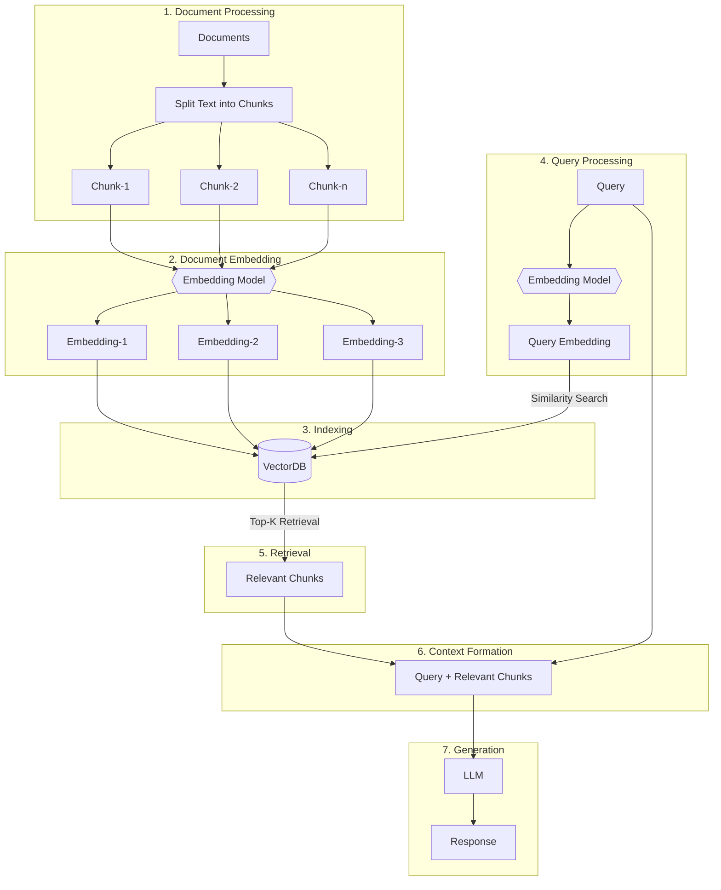

<div align="center">

# Basic RAG

### [AI Engineering.academy](https://aiengineering.academy/)

<a href="https://aiengineering.academy/" target="_blank">

</a>

[](https://github.com/adithya-s-k/AI-Engineering.academy/stargazers)
[](https://github.com/adithya-s-k/AI-Engineering.academy/network/members)
[](https://github.com/adithya-s-k/AI-Engineering.academy/issues)
[](https://github.com/adithya-s-k/AI-Engineering.academy/pulls)
[](https://github.com/adithya-s-k/AI-Engineering.academy/blob/main/LICENSE)

</div>

## Introduction

Retrieval-Augmented Generation (RAG) is a powerful technique that combines the strengths of large language models with the ability to retrieve relevant information from a knowledge base. This approach enhances the quality and accuracy of generated responses by grounding them in specific, retrieved information.
a
This notebook aims to provide a clear and concise introduction to RAG, suitable for beginners who want to understand and implement this technology.

### RAG Flow



## Get Started

### Notebook
You can run the notebook provided in this repository.

### Chat Application
1. Install dependencies:
   ```
   pip install -r requirements.txt
   ```
2. Run the application:
   ```
   python app.py
   ```
3. To ingest data on the go:
   ```
   python app.py --ingest --data_dir /path/to/documents
   ```

### Server
Run the server with:
```
python server.py
```

The server has two endpoints:
- `/api/ingest`
- `/api/query`

## Motivation

Traditional language models generate text based on learned patterns from training data. However, when presented with queries that require specific, updated, or niche information, they may struggle to provide accurate responses. RAG addresses this limitation by incorporating a retrieval step that provides the language model with relevant context to generate more informed answers.

## Method Details

### Document Preprocessing and Vector Store Creation

1. **Document Chunking**: The knowledge base documents (e.g., PDFs, articles) are preprocessed and split into manageable chunks. This creates a searchable corpus that can be efficiently used in the retrieval process.
   
2. **Embedding Generation**: Each chunk is converted into a vector representation using pre-trained embeddings (e.g., OpenAI's embeddings). This allows the documents to be stored in a vector database, such as Qdrant, enabling efficient similarity searches.

### Retrieval-Augmented Generation Workflow

1. **Query Input**: A user provides a query that needs to be answered.
   
2. **Retrieval Step**: The query is embedded into a vector using the same embedding model that was used for the documents. A similarity search is then performed in the vector database to find the most relevant document chunks.

3. **Generation Step**: The retrieved document chunks are passed to a large language model (e.g., GPT-4) as additional context. The model uses this context to generate a more accurate and relevant response.

## Key Features of RAG

1. **Contextual Relevance**: By grounding responses in actual retrieved information, RAG models can produce more contextually relevant and accurate answers.
   
2. **Scalability**: The retrieval step can scale to handle large knowledge bases, allowing the model to draw from vast amounts of information.

3. **Flexibility in Use Cases**: RAG can be adapted for a variety of applications, including question answering, summarization, recommendation systems, and more.

4. **Improved Accuracy**: Combining generation with retrieval often yields more precise results, especially for queries requiring specific or lesser-known information.

## Benefits of this Approach

1. **Combines Strengths of Both Retrieval and Generation**: RAG effectively merges retrieval-based methods with generative models, allowing for both precise fact-finding and natural language generation.

2. **Enhanced Handling of Long-Tail Queries**: It is particularly effective for queries where specific and less frequently occurring information is needed.

3. **Domain Adaptability**: The retrieval mechanism can be tuned to specific domains, ensuring that the generated responses are grounded in the most relevant and accurate domain-specific information.

## Conclusion

Retrieval-Augmented Generation (RAG) represents an innovative fusion of retrieval and generation techniques, significantly enhancing the capabilities of language models by grounding their outputs in relevant external information. This approach can be particularly valuable in scenarios requiring precise, context-aware responses, such as customer support, academic research, and more. As AI continues to evolve, RAG stands out as a powerful method for building more reliable and context-sensitive AI systems.

## Prerequisites

- Preferably Python 3.11
- Jupyter Notebook or JupyterLab
- LLM API Key
  - You can use any LLM of your choice. In this notebook, we have used OpenAI and GPT-4o-mini.

With these steps, you can implement a basic RAG system to enhance the capabilities of language models by incorporating real-world, up-to-date information, improving their effectiveness in various applications.