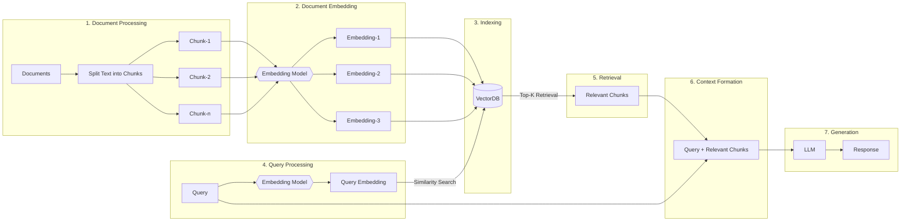
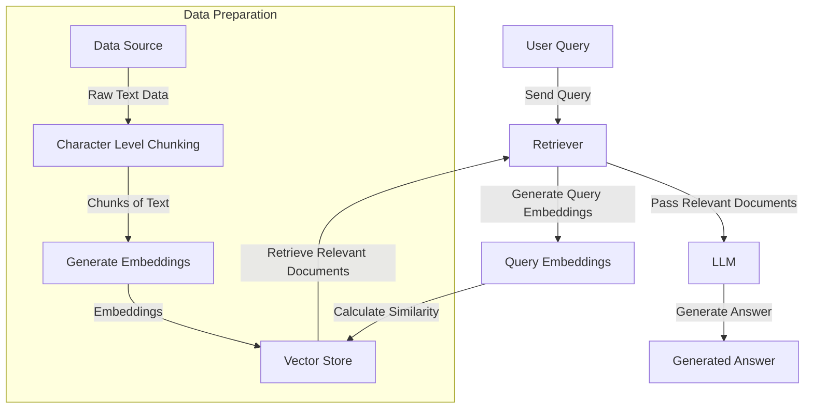

# Basic RAG Implementation: A Beginner's Guide to Retrieval-Augmented Generation


Welcome to the Basic RAG Implementation guide! This notebook is designed to introduce beginners to the concept of Retrieval-Augmented Generation (RAG) and provide a step-by-step walkthrough of implementing a basic RAG system.



## Table of Contents

1. [Introduction](#introduction)
2. [Getting Started](#getting-started)
3. [Notebook Contents](#notebook-contents)
4. [Usage](#usage)
5. [Conclusion](#conclusion)
6. [Contributing](#contributing)
7. [License](#license)

## Introduction

Retrieval-Augmented Generation (RAG) is a powerful technique that combines the strengths of large language models with the ability to retrieve relevant information from a knowledge base. This approach enhances the quality and accuracy of generated responses by grounding them in specific, retrieved information.

This notebook aims to provide a clear and concise introduction to RAG, suitable for beginners who want to understand and implement this technology.



## Getting Started

To get started with this notebook, you'll need to have a basic understanding of Python and some familiarity with machine learning concepts. Don't worry if you're new to some of these ideas – we'll guide you through each step!

### Prerequisites

- Python 3.7+
- Jupyter Notebook or JupyterLab
- Basic knowledge of Python and machine learning concepts

## Notebook Contents

Our notebook is structured into the following main sections:

1. **Environment Set Up**: We'll guide you through setting up your Python environment with all the necessary libraries and dependencies.

2. **Data Ingestion (Chunking)**: Learn how to prepare and process your data for use in a RAG system, including techniques for breaking down large texts into manageable chunks.

3. **Prompting**: Understand the art of crafting effective prompts to guide the retrieval and generation process.

4. **Setting up Retriever**: We'll walk you through the process of setting up a retrieval system to find relevant information from your knowledge base.

5. **Examples with Retrievers**: Explore practical examples of using retrievers in various scenarios to enhance your understanding of RAG systems.

## Usage

## 1. Setting up the Environment

Let's begin with installing necessary packages to set up LlamaIndex with vector stores in Qdrant, file readers, and OpenAI integration.

### 1.1 Install LlamaIndex and Associated Packages

`llama-index` is a versatile package that supports various integrations, including vector stores, file readers, and different LLMs.

```python
!pip install llama-index
!pip install llama-index-vector-stores-qdrant
!pip install llama-index-readers-file
!pip install llama-index-embeddings-fastembed
!pip install llama-index-llms-openai
```

### 1.2 Install Qdrant Client and FastEmbed

Qdrant is a high-performance vector search engine and database that can store and query embeddings. `fastEmbed` is used for generating fast embeddings.

```python
pip install -U qdrant_client fastembed
```

### 1.3 Install Python Dotenv

`python-dotenv` is used to load environment variables from a .env file. This is particularly useful for managing API keys, credentials, and other configuration settings securely.

```python
pip install python-dotenv
```

A brief overview of all the packages installed in the above steps:

- `llama-index`: Core framework for building Retrieval-Augmented Generation (RAG) systems.
- `llama-index-vector-stores-qdrant`: Integrates Qdrant for storing and retrieving vector embeddings.
- `llama-index-readers-file`: Enables file reading and data ingestion within LlamaIndex.
- `llama-index-embeddings-fastembed`: Provides fast embedding generation for efficient data retrieval.
- `llama-index-llms-openai`: Connects LlamaIndex with OpenAI's language models for text generation.
- `qdrant_client`: Official client for interacting with the Qdrant vector search engine.
- `fastembed`: Generates fast embeddings for vectorizing text data.
- `python-dotenv`: Loads environment variables from a .env file for secure configuration management.

### 1.3 Import Standard Libraries

```python
import logging
import sys
import os
```

- `logging`: Used to log messages, which can simplify debugging and tracking the execution of the script.
- `sys`: Provides access to system-specific parameters and functions, useful for interacting with the Python runtime environment.
- `os`: Allows interaction with the operating system, mainly used to manage environment variables and file paths.

### 1.4 Import Third-Party Libraries

```python
from dotenv import load_dotenv
from IPython.display import Markdown, display
```

- `dotenv`: Helps to load environment variables from a .env file into the Python environment, which is crucial for managing sensitive information like API keys.
- `IPython.display`: These functions are used for displaying content, particularly Markdown, in Jupyter notebooks, enhancing the readability and presentation of the notebook.

### 1.6 Import Qdrant Client

```python
import qdrant_client
```

- `qdrant_client`: This is the official client library for interacting with the Qdrant vector search engine, used for storing and retrieving vector embeddings in a highly efficient manner.

### 1.7 Import LlamaIndex Core Components

```python
from llama_index.core import VectorStoreIndex, SimpleDirectoryReader
from llama_index.core import Settings
```

- `VectorStoreIndex`: Manages the indexing of data in a vector store, enabling efficient retrieval based on embeddings.
- `SimpleDirectoryReader`: Facilitates reading and processing files from a directory, typically used for data ingestion in the RAG system.
- `Settings`: Provides a way to configure global settings, such as the embedding model used across the entire RAG system.

### 1.7 Import LlamaIndex Vector Store

```python
from llama_index.vector_stores.qdrant import QdrantVectorStore
```

- `QdrantVectorStore`: This class provides an interface for integrating Qdrant with LlamaIndex, allowing for the storage and retrieval of vectors using Qdrant's high-performance search engine.

### 1.7 Import Embedding Models

```python
from llama_index.embeddings.fastembed import FastEmbedEmbedding
from llama_index.embeddings.openai import OpenAIEmbedding
```

- `FastEmbedEmbedding`: Allows for the quick generation of vector embeddings using the FastEmbed model, which is optimized for performance.
- `OpenAIEmbedding`: Enables embedding generation using OpenAI's API, suitable for cases where high-quality embeddings are required.

### 1.8 Import OpenAI Language Model

```python
from llama_index.llms.openai import OpenAI
```

- `OpenAI`: Provides an interface to interact with OpenAI's large language models, enabling text generation that can be grounded in retrieved information from the RAG system.

### 1.8 Load Environment Variables

```python
load_dotenv()
```

Loading the environment variables from a .env file into the system environment. This is essential for securely managing configuration settings like API keys, which are accessed using `os.getenv()`.

### 1.10 Retrieve OpenAI API Key

```python
OPENAI_API_KEY = os.getenv("OPENAI_API_KEY")
```

Retrieving the OpenAI API key from the environment variables. This key is needed to authenticate requests to OpenAI’s API.

### 1.11 Set the Embedding Model

```python
# Option 1: Use FastEmbed with BAAI/bge-base-en-v1.4 model (default)
Settings.embed_model = FastEmbedEmbedding(model_name="BAAI/bge-base-en-v1.4")

# Option 2: Use OpenAI's embedding model (commented out)
# If you want to use OpenAI's embedding model, uncomment the following line:
# Settings.embed_model = OpenAIEmbedding(embed_batch_size=10, api_key=OPENAI_API_KEY)
```

- **Option 1:** The script sets the default embedding model to FastEmbedEmbedding, using the BAAI/bge-base-en-v1.4 model. This model is optimized for speed and efficiency.

- **Option 2:** Alternatively, you can choose to use OpenAI's embedding model by uncommenting this line. This option is preferable when high-quality embeddings are required, and the OpenAI API is available.

### 1.12 Qdrant Configuration (Optional)

```python
# Qdrant configuration (commented out)
# If you're using Qdrant, uncomment and set these variables:
# QDRANT_CLOUD_ENDPOINT = os.getenv("QDRANT_CLOUD_ENDPOINT")
# QDRANT_API_KEY = os.getenv("QDRANT_API_KEY")

# Note: Remember to add QDRANT_CLOUD_ENDPOINT and QDRANT_API_KEY to your .env file if using Qdrant Hosted version
```

- **Qdrant Configuration**: If you are using a hosted Qdrant instance, you need to configure the endpoint and API key by uncommenting these lines. Ensure that `QDRANT_CLOUD_ENDPOINT`and `QDRANT_API_KEY` are set in your .env file to securely manage these credentials.

## 2. Loading and Preparing Documents

In this step, we load documents from a specified directory, then combine them into a single document to prepare for further processing, such as chunking and splitting.

```python
# Import the Document class from llama_index
from llama_index.core import Document
```

`Document`: This class represents a single document in the LlamaIndex framework and is used to encapsulate the text data that will be processed and later utilized in the RAG system.

```python
# Initialize the SimpleDirectoryReader with the directory path
reader = SimpleDirectoryReader("../data/", recursive=True)
```

`SimpleDirectoryReader`: This is a utility class that reads all the files from a specified directory (`../data/` in this case, change your path accordingly). `The recursive=True` parameter ensures that the reader will look for files in all subdirectories within `../data/`, allowing for the comprehensive loading of all text files in that folder.

```python
# Load the documents using the reader and show progress while loading
documents = reader.load_data(show_progress=True)
```

```python
# Combine the text from all documents into a single Document instance
documents = Document(text="\n\n".join([doc.text for doc in documents]))
```

This code combines the text of all loaded documents into a single Document instance, ensuring clear separation between each document's text using double newlines (\n\n). The combined text is wrapped in a Document object for later processing, such as chunking or splitting in the RAG system.

## 3. Setting Up the Vector Database

We can now get started to set up `Qdrant`, a highly optimized vector search engine and database as the vector database to store and retrieve embeddings efficiently.

```python
# Import the Qdrant client
import qdrant_client
```

### 3.1 Initializing Qdrant

You have multiple options for setting up Qdrant based on your deployment requirements:

#### a. In-Memory:

```python
client = qdrant_client.QdrantClient(location=":memory:")
```

The `:memory:` location allows Qdrant to run entirely in memory, which is faster but doesn't persist data between sessions. Suitable for quick, lightweight experiments where persistence isn't necessary.

#### b. Disk-Based:

Qdrant is initialised to store data on disk in the specified directory (./data), allowing for data persistence.

```python
client = qdrant_client.QdrantClient(path="./data")
```

#### c. Self-Hosted or Docker:

If you have Qdrant running on a server or in a Docker container, you can connect to it via host and port.

```python
client = qdrant_client.QdrantClient(
    host="localhost",
    port=6333
)
```

#### d. Qdrant Cloud:

For cloud-based deployment, use Qdrant's cloud service with API key authentication.

```python
client = qdrant_client.QdrantClient(
 url=QDRANT_CLOUD_ENDPOINT,
    api_key=QDRANT_API_KEY,
)
```

### 3.2 Creating a Qdrant Client Instance

For this notebook, we'll use the in-memory mode for quick experiments.

```python
# Create a Qdrant client instance
client = qdrant_client.QdrantClient(
    location=":memory:"  # Using in-memory mode for fast, light-weight experiments
)
```

`QdrantClient(location=":memory:")`: Initializes a Qdrant client instance in in-memory mode. This setup is optimal for rapid prototyping and testing, as it doesn't require a deployed Qdrant instance or persistence.

### 3.3 Setting Up the Vector Store

```python
# Create a Qdrant vector store instance
vector_store = QdrantVectorStore(client=client, collection_name="01_Basic_RAG")
```

- `client=client`: Links the QdrantVectorStore to the previously created Qdrant client.
- `collection_name="01_Basic_RAG"`: Specifies the collection name in the Qdrant vector store where the embeddings will be stored. Collections in Qdrant are akin to tables in relational databases, and here, `"01_Basic_RAG"` is the designated name for this particular experiment or application.

## 4. Ingesting Data into the Vector Database

Let's proceed by setting up an ingestion pipeline to process and insert our documents into the Qdrant vector database. This pipeline will handle document chunking, embedding, and storage, ensuring that the data is properly indexed and ready for retrieval during the RAG process.

### 4.1 Importing various splitters and parsers from llama_index

```python
# Import various splitters and parsers from llama_index
from llama_index.core.node_parser import TokenTextSplitter
from llama_index.core.node_parser import SentenceSplitter
from llama_index.core.node_parser import MarkdownNodeParser
from llama_index.core.node_parser import SemanticSplitterNodeParser
```

- `TokenTextSplitter`: Splits text into chunks based on tokens, useful when working with models that have token limits.

- `SentenceSplitter`: Splits text into chunks based on sentences, ensuring that each chunk is coherent and logically complete.

- `MarkdownNodeParser`: Parses Markdown documents, which can be helpful if your data is in Markdown format and you want to preserve the structure and metadata.

- `SemanticSplitterNodeParser`: Splits text based on semantic content, using an embedding model to ensure that each chunk is semantically coherent.

These splitters and parsers are different strategies to break down the document into manageable chunks before embedding and storing them in the vector database.

```python
# Import IngestionPipeline from llama_index
from llama_index.core.ingestion import IngestionPipeline
```

This class automates the transformation and ingestion of documents into the vector database by applying specified transformations and storing the results in the vector store.

### 4.2 Setting Up the Ingestion Pipeline

```python
pipeline = IngestionPipeline(
    transformations=[
        # MarkdownNodeParser(include_metadata=True),
        # TokenTextSplitter(chunk_size=400, chunk_overlap=20),
        SentenceSplitter(chunk_size=1023, chunk_overlap=20),
        # SemanticSplitterNodeParser(buffer_size=1, breakpoint_percentile_threshold=84 , embed_model=Settings.embed_model),
        Settings.embed_model,
    ],
    vector_store=vector_store,
)
```

- `transformations=[...]`: takes a list of transformations that will be applied to the document before storing it in the vector database. Each transformation serves a specific purpose:

- `MarkdownNodeParser(include_metadata=True)`: (Commented out) This transformation would parse Markdown documents, including metadata in the resulting nodes.

- `TokenTextSplitter(chunk_size=400, chunk_overlap=20)`: (Commented out) Splits text into chunks of 400 tokens, with a 20-token overlap between chunks, ensuring that important information at the boundaries isn't lost.

- `SentenceSplitter(chunk_size=1023, chunk_overlap=20)`: The chosen transformation here splits the document into chunks of up to 1023 sentences with a 20-sentence overlap, ensuring ensures the chunks remain logically and contextually coherent.

- `SemanticSplitterNodeParser(buffer_size=1, breakpoint_percentile_threshold=84, embed_model=Settings.embed_model)`: (Commented out) This more advanced transformation splits the text based on semantic content, using the specified embedding model to ensure chunks are semantically meaningful.

- `Settings.embed_model`: Embeds the resulting chunks using the embedding model defined earlier, converting them into vectors that can be stored in the vector database.

- `vector_store=vector_store`: Specifies the target vector store where the processed data will be stored. This links the ingestion pipeline to the QdrantVectorStore instance created earlier.

### 4.3 Running the Ingestion Pipeline

```python
# Ingest documents directly into the vector database
nodes = pipeline.run(documents=[documents], show_progress=True)
```

This command processes the document(s) through the specified transformations (chunking and embedding) and ingests the resulting nodes into the vector store.

### 4.4 Output

```python
# Output the number of chunks added to the vector database
print("Number of chunks added to vector DB:", len(nodes))
```

This is done to provide insight into how the document was split and stored in the vector database.

## 5. Setting Up the Retriever

In this step, we will set up a retriever that will leverage the vector store we populated in the previous step.

The retriever is responsible for querying the vector database and retrieving the most relevant chunks of data in response to a given prompt or query. This is a critical component in the Retrieval-Augmented Generation (RAG) process, as it ensures that generated responses are grounded in the most relevant information from the knowledge base.

```python
# Set up the retriever by creating an index from the vector store
index = VectorStoreIndex.from_vector_store(vector_store=vector_store)
```

`VectorStoreIndex` creates an index from a vector store, organizing and managing embedded data chunks to enable efficient and effective querying of the vector database.
`from_vector_store(vector_store=vector_store)` initializes the `VectorStoreIndex` by linking it directly to the specified vector_store, where the embedded data chunks are stored.

**Purpose:** The index serves as the interface between retrieval queries and the vector store, efficiently searching through the vector database to return the most relevant data chunks. This step ensures that the RAG system can quickly and accurately retrieve information for generating grounded responses.

## 6. Modifying Prompts

Now, let's set up custom prompts for interacting with the language model. Prompts are templates that guide the model's behavior and structure its responses.

The two main prompts defined here are for generating an initial answer based on retrieved context and for refining an existing answer if additional context is provided.

### 6.1 Defining the QA prompt template

```python
# Import the ChatPromptTemplate class from llama_index
from llama_index.core import ChatPromptTemplate

# Define the QA prompt template
qa_prompt_str = (
    "Context information is below.\n"
    "---------------------\n"
    "{context_str}\n"
    "---------------------\n"
    "Given the context information and not prior knowledge, "
    "answer the question: {query_str}\n"
)
```

`qa_prompt_str`: This string is the template for the initial question-answering (QA) prompt. It includes placeholders {context_str} and {query_str} that will be filled with the relevant context and the user's query, respectively. The prompt instructs the AI to use only the provided context to answer the question, avoiding reliance on prior knowledge.

### 6.2 Defining the refine prompt template

```python
# Define the refine prompt template
refine_prompt_str = (
    "We have the opportunity to refine the original answer "
    "(only if needed) with some more context below.\n"
    "------------\n"
    "{context_msg}\n"
    "------------\n"
    "Given the new context, refine the original answer to better "
    "answer the question: {query_str}. "
    "If the context isn't useful, output the original answer again.\n"
    "Original Answer: {existing_answer}"
)
```

`refine_prompt_str`: This string is the template for refining an existing answer. It provides the AI with additional context and asks it to improve the initial answer if necessary. The placeholders {context_msg}, {query_str}, and {existing_answer} will be populated with the new context, the original query, and the initial answer, respectively. If the new context doesn't provide useful information, the AI is instructed to return the original answer.

### 6.3 The Text QA Prompt

```python
# Text QA Prompt
chat_text_qa_msgs = [
    ("system","You are an AI assistant who is well-versed in answering questions from the provided context"),
    ("user", qa_prompt_str),
]
text_qa_template = ChatPromptTemplate.from_messages(chat_text_qa_msgs)
```

- `chat_text_qa_msgs`: This list of tuples defines the sequence of messages that make up the initial QA prompt interaction. The first tuple specifies the system's role, while the second contains the user's prompt template. The system message establishes the AI's identity as a context-aware assistant.

- `text_qa_template = ChatPromptTemplate.from_messages(chat_text_qa_msgs)`: This line creates a ChatPromptTemplate object from the list of messages, setting up the template that will be used to generate answers based on context.

### 6.4 The Refine Prompt

```python
# Refine Prompt
chat_refine_msgs = [
    ("system","Always answer the question, even if the context isn't helpful.",),
    ("user", refine_prompt_str),
]
refine_template = ChatPromptTemplate.from_messages(chat_refine_msgs)
```

- `chat_refine_msgs`: This list of tuples sets up the refine prompt interaction. The system instructs the AI to always attempt to answer the question, even if the new context isn't helpful, reinforcing that the AI should still provide the best possible answer.

- `refine_template = ChatPromptTemplate.from_messages(chat_refine_msgs)`: This line creates a ChatPromptTemplate object for the refining process, guiding the AI to refine its answers when additional context is available.

## 7. Setting Up Query and Chat Engines

Here, we will set up the Query Engine and Chat Engine to interact with the vector database and the language model.

### 7.1 Setting up the Query Engine

```python
from llama_index.llms.openai import OpenAI
llm = OpenAI()
```

Importing the OpenAI class from the LlamaIndex library, allowing us to instantiate a language model (LLM) powered by OpenAI and creating an instance.

```python
rag_engine = index.as_query_engine(
    text_qa_template=text_qa_template,
    refine_template=refine_template,
    llm=llm,
)
```

`rag_engine = index.as_query_engine(...)` sets up the Query Engine, integrating the vector database (index) with the language model (LLM) and using predefined templates (text_qa_template and refine_template) for generating and refining answers. This configuration enables the Query Engine to process queries and retrieve relevant information from the vector store using the OpenAI model.

```python
response = rag_engine.query("What is Paul Graham")
display(Markdown(str(response)))
```

`response = rag_engine.query("What is Paul Graham?")` queries the RAG engine to retrieve relevant context from the vector database and generate an answer using the OpenAI LLM.
display(Markdown(str(response))) then formats and displays the response as Markdown in the Jupyter notebook for improved readability.

### 7.2 Setting up the Chat Engine

```python
chat_engine = index.as_chat_engine()
```

This line sets up the Chat Engine, which allows for interactive conversations with the AI model. Unlike the Query Engine, which focuses on specific queries, the Chat Engine is designed for back-and-forth dialogue, enabling a more conversational interaction with the AI.

```python
response = chat_engine.chat("What is Paul Graham")
display(Markdown(str(response)))
```

- `response = chat_engine.chat("What is Paul Graham"):` This initiates a chat session with the Chat Engine, asking the same question, "What is Paul Graham?" The Chat Engine processes the input and generates a response using the underlying language model.

- `display(Markdown(str(response)))`: Similar to the Query Engine, this line displays the response as formatted Markdown in the notebook, making the output easier to read.

## 8. Simple Chat Application with RAG

In our final step, we will create a simple chat application that leverages Retrieval-Augmented Generation (RAG) using a custom ChatEngineInterface class. The application enables interactive conversations with an AI assistant by combining chat history with RAG capabilities.

### Creating the Chat Interface

### 8.1 Imports and Class Definition

```python
from typing import List
from llama_index.core.base.llms.types import ChatMessage, MessageRole
```

- `from typing import List`: Imports the List type for type hinting.

- `from llama_index.core.base.llms.types import ChatMessage, MessageRole`: Imports ChatMessage and MessageRole for handling chat messages and their roles.

### 8.2 Class Initialization

```python
class ChatEngineInterface:
    def __init__(self, index):
        self.chat_engine = index.as_chat_engine()
        self.chat_history: List[ChatMessage] = []
```

- `class ChatEngineInterface`: Defines a new class to manage chat interactions.

- `def __init__(self, index)`: The constructor method initializes the chat engine and history. It accepts index, which represents the vector index used for setting up the chat engine.

- `self.chat_engine = index.as_chat_engine()`: Initializes the chat engine using the provided vector index, enabling it to process user queries with the RAG setup.

- `self.chat_history: List[ChatMessage] = []`: Initializes an empty list to store chat history, with each entry being a ChatMessage object representing an interaction.

### 8.3 Displaying Messages

```python
    def display_message(self, role: str, content: str):
        if role == "USER":
            display(Markdown(f"**Human:** {content}"))
        else:
            display(Markdown(f"**AI:** {content}"))
```

The `display_message` method shows messages based on their role; it labels user messages as "Human" and AI responses as "AI" using Markdown formatting. User messages are displayed with "Human:" and AI responses with "AI:" in Markdown format.

### 8.3 Chat Interaction

```python
def chat(self, message: str) -> str:
    user_message = ChatMessage(role=MessageRole.USER, content=message)
    self.chat_history.append(user_message)

    response = self.chat_engine.chat(message, chat_history=self.chat_history)

    ai_message = ChatMessage(role=MessageRole.ASSISTANT, content=str(response))
    self.chat_history.append(ai_message)

    self.display_message("USER", message)
    self.display_message("ASSISTANT", str(response))

    print("\n" + "-"*40 + "\n")  # Separator for readability

    return str(response)
```

The `chat` method processes a user message by creating a `ChatMessage` instance for it and appending it to the chat history. It then retrieves the AI response from the chat engine, creates a `ChatMessage` instance for the AI response, and appends it to the history.

Both messages are displayed using the `display_message` method, and a separator is printed for readability. Finally, the method returns the AI's response as a string.

### 8.4 Getting Chat History

```python
def get_chat_history(self) -> List[ChatMessage]:
return self.chat_history
```

This method returns the list of `ChatMessage` objects representing the chat history.

### 8.6 Running the Chat Interface

```python
chat_interface = ChatEngineInterface(index)
while True:
    user_input = input("You: ").strip()
    if user_input.lower() == 'exit':
        print("Thank you for chatting! Goodbye.")
        break
    chat_interface.chat(user_input)
```

The `chat_interface` is initialized with the vector index, preparing it for interaction. An infinite loop prompts the user for input, which is processed by the chat_interface until the user types "exit" to end the chat. The user's input is sent to `chat_interface.chat`, which handles the interaction and provides the AI's response.

### 8.7 Viewing Chat History

```python
# To view chat history:
history = chat_interface.get_chat_history()
for message in history:
    print(f"{message.role}: {message.content}")
```

The chat history is retrieved from `chat_interface` and iterated through to print each message, displaying the role ("USER" or "ASSISTANT") along with the content.

## Conclusion

We have now reached the end of a comprehensive setup for a Retrieval-Augmented Generation (RAG) system, including data ingestion, index creation, prompt customization, and interactive chat functionality. With clear illustrations of integration of vector databases, custom prompts, and chat interfaces for efficient and effective query handling, we hope this guide was as thorough as it could be.

If you find this guide helpful, please consider giving us a star on GitHub! ⭐

[](https://github.com/adithya-s-k/AI-Engineering.academy)

Happy learning, and enjoy your journey into the world of Retrieval-Augmented Generation!

## Contributing

## License
