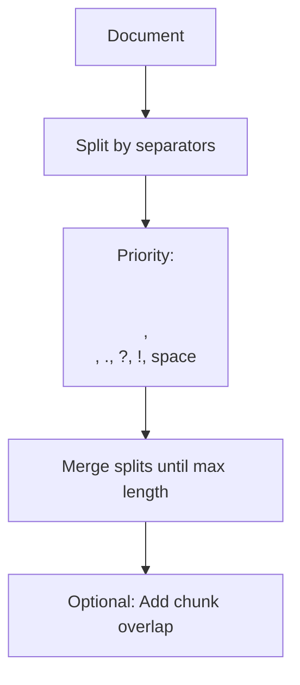
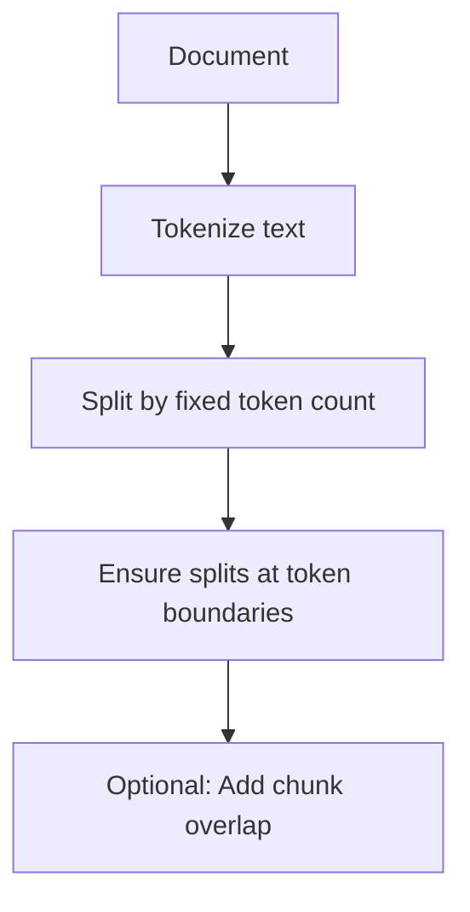
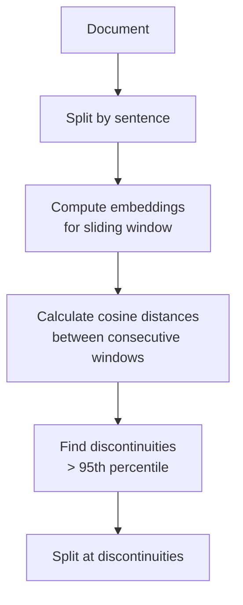
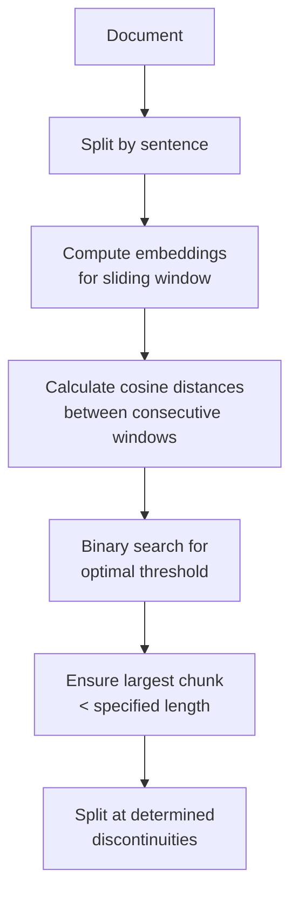
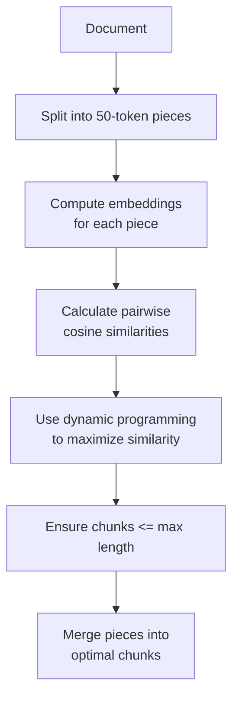
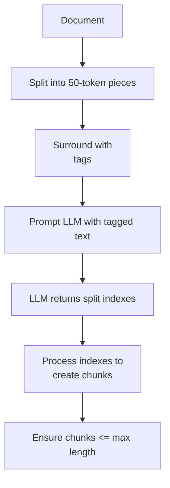
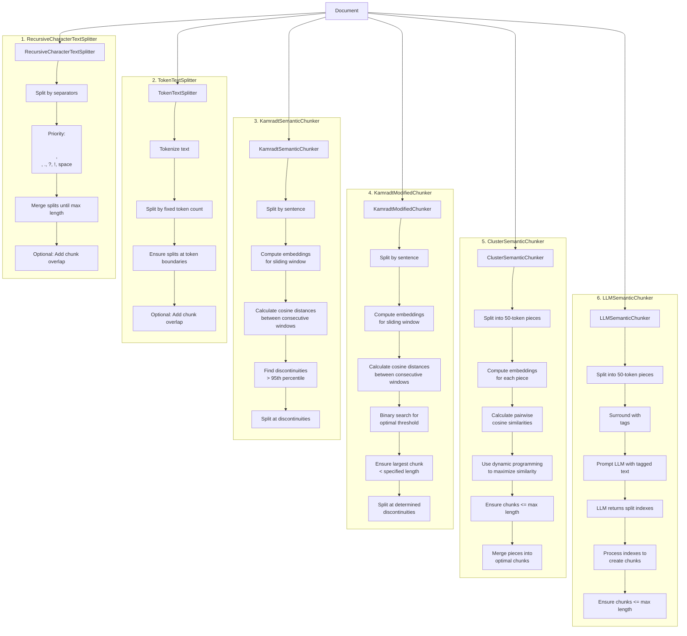

# Data Chunking for RAG Systems

## Introduction

Data chunking is a crucial step in Retrieval-Augmented Generation (RAG) systems. It involves breaking down large documents into smaller, manageable pieces that can be efficiently indexed, retrieved, and processed. This README provides an overview of various chunking methods that can be used in RAG pipelines.

## Importance of Chunking in RAG

Effective chunking is essential for RAG systems because it:
1. Improves retrieval accuracy by creating coherent, self-contained units of information.
2. Enhances the efficiency of embedding generation and similarity search.
3. Allows for more precise context selection when generating responses.
4. Helps manage token limits in language models and embedding systems.

## Chunking Methods

We have implemented six different chunking methods, each with its own strengths and use cases:

1. RecursiveCharacterTextSplitter
2. TokenTextSplitter
3. KamradtSemanticChunker
4. KamradtModifiedChunker
5. ClusterSemanticChunker
6. LLMSemanticChunker

## Chunking Workflows

### 1. RecursiveCharacterTextSplitter



### 2. TokenTextSplitter



### 3. KamradtSemanticChunker



### 4. KamradtModifiedChunker



### 5. ClusterSemanticChunker



### 6. LLMSemanticChunker



## Method Descriptions

1. **RecursiveCharacterTextSplitter**: Splits text based on a hierarchy of separators, prioritizing natural breaks in the document.

2. **TokenTextSplitter**: Splits text into chunks of a fixed number of tokens, ensuring that splits occur at token boundaries.

3. **KamradtSemanticChunker**: Uses sliding window embeddings to identify semantic discontinuities and split the text accordingly.

4. **KamradtModifiedChunker**: An improved version of KamradtSemanticChunker that uses binary search to find an optimal threshold for splitting.

5. **ClusterSemanticChunker**: Splits text into small pieces, computes embeddings, and uses dynamic programming to create optimal chunks based on semantic similarity.

6. **LLMSemanticChunker**: Utilizes a language model to determine appropriate split points in the text.

## Usage

To use these chunking methods in your RAG pipeline:

1. Import the desired chunker from the `chunkers` module.
2. Initialize the chunker with appropriate parameters (e.g., max chunk size, overlap).
3. Pass your document through the chunker to obtain the chunks.

Example:

```python
from chunkers import RecursiveCharacterTextSplitter

chunker = RecursiveCharacterTextSplitter(chunk_size=1000, chunk_overlap=200)
chunks = chunker.split_text(your_document)
```

## Choosing a Chunking Method

The choice of chunking method depends on your specific use case:

- For simple text splitting, use RecursiveCharacterTextSplitter or TokenTextSplitter.
- For semantic-aware splitting, consider KamradtSemanticChunker or KamradtModifiedChunker.
- For more advanced semantic chunking, use ClusterSemanticChunker or LLMSemanticChunker.

Factors to consider when choosing a method:
- Document structure and content type
- Desired chunk size and overlap
- Computational resources available
- Specific requirements of your retrieval system (e.g., vector vs. keyword-based)

Experiment with different methods to find the one that works best for your documents and retrieval needs.

## Integration with RAG Systems

After chunking, typically you would:
1. Generate embeddings for each chunk (for vector-based retrieval systems).
2. Index the chunks in your chosen retrieval system (e.g., vector database, inverted index).
3. Use the indexed chunks in your retrieval step when answering queries.

## Contributing

We welcome contributions to improve existing chunking methods or add new ones. Please refer to our contributing guidelines for more information.

## License

This project is licensed under the MIT License. See the LICENSE file for details.

