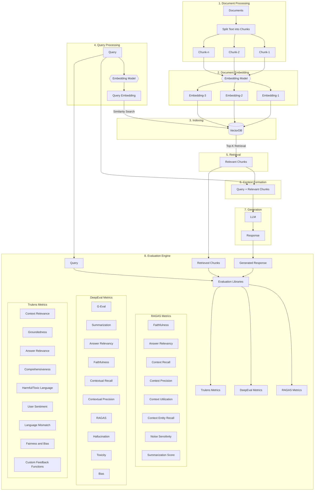

```mermaid
flowchart TB
    subgraph "1. Document Processing"
        A[Documents] --> B[Split Text into Chunks]
        B --> C1[Chunk-1]
        B --> C2[Chunk-2]
        B --> C3[Chunk-n]
    end
    
    subgraph "2. Document Embedding"
        EM1{{Embedding Model}}
        C1 & C2 & C3 --> EM1
        EM1 --> D1[Embedding-1] & D2[Embedding-2] & D3[Embedding-3]
    end
    
    subgraph "3. Indexing"
        D1 & D2 & D3 --> E[(VectorDB)]
    end
    
    subgraph "4. Query Processing"
        F[Query] --> EM2{{Embedding Model}}
        EM2 --> G[Query Embedding]
    end
    
    subgraph "5. Retrieval"
        G -->|Similarity Search| E
        E -->|Top-K Retrieval| H[Relevant Chunks]
    end
    
    subgraph "6. Context Formation"
        H --> I[Query + Relevant Chunks]
    end
    
    subgraph "7. Generation"
        I --> J[LLM]
        J --> K[Response]
    end
    
    F --> I
    
    subgraph "8. Evaluation Engine"
        L[Evaluation Libraries]
        M[Query]
        N[Retrieved Chunks]
        O[Generated Response]
        
        M & N & O --> L
        
        L --> P[RAGAS Metrics]
        L --> Q[DeepEval Metrics]
        L --> R[Trulens Metrics]
        
        subgraph "RAGAS Metrics"
            P1[Faithfulness]
            P2[Answer Relevancy]
            P3[Context Recall]
            P4[Context Precision]
            P5[Context Utilization]
            P6[Context Entity Recall]
            P7[Noise Sensitivity]
            P8[Summarization Score]
        end
        
        subgraph "DeepEval Metrics"
            Q1[G-Eval]
            Q2[Summarization]
            Q3[Answer Relevancy]
            Q4[Faithfulness]
            Q5[Contextual Recall]
            Q6[Contextual Precision]
            Q7[RAGAS]
            Q8[Hallucination]
            Q9[Toxicity]
            Q10[Bias]
        end
        
        subgraph "Trulens Metrics"
            R1[Context Relevance]
            R2[Groundedness]
            R3[Answer Relevance]
            R4[Comprehensiveness]
            R5[Harmful/Toxic Language]
            R6[User Sentiment]
            R7[Language Mismatch]
            R8[Fairness and Bias]
            R9[Custom Feedback Functions]
        end
    end
    
    F --> M
    H --> N
    K --> O
```