# Evaluation of RAG Systems

## Introduction

Evaluation is a critical component in the development and optimization of Retrieval-Augmented Generation (RAG) systems. It involves assessing the performance, accuracy, and quality of various aspects of the RAG pipeline, from retrieval effectiveness to the relevance and faithfulness of generated responses.

## Importance of Evaluation in RAG

Effective evaluation of RAG systems is essential because it:

1. Helps identify strengths and weaknesses in the retrieval and generation processes.
2. Guides improvements and optimizations across the RAG pipeline.
3. Ensures the system meets quality standards and user expectations.
4. Facilitates comparison between different RAG implementations or configurations.
5. Helps detect issues such as hallucinations, biases, or irrelevant responses.

## RAG Evaluation Workflow

The evaluation process in RAG systems typically involves the following steps:

```mermaid
flowchart TB
    subgraph "1. Input"
        A[Query] --> E[Evaluation Engine]
        B[Retrieved Chunks] --> E
        C[Generated Response] --> E
    end

    subgraph "2. Evaluation Engine"
        E --> F[Evaluation Libraries]
        F --> G[RAGAS Metrics]
        F --> H[DeepEval Metrics]
        F --> I[Trulens Metrics]
    end

    subgraph "3. RAGAS Metrics"
        G --> G1[Faithfulness]
        G --> G2[Answer Relevancy]
        G --> G3[Context Recall]
        G --> G4[Context Precision]
        G --> G5[Context Utilization]
        G --> G6[Context Entity Recall]
        G --> G7[Noise Sensitivity]
        G --> G8[Summarization Score]
    end

    subgraph "4. DeepEval Metrics"
        H --> H1[G-Eval]
        H --> H2[Summarization]
        H --> H3[Answer Relevancy]
        H --> H4[Faithfulness]
        H --> H5[Contextual Recall]
        H --> H6[Contextual Precision]
        H --> H7[RAGAS]
        H --> H8[Hallucination]
        H --> H9[Toxicity]
        H --> H10[Bias]
    end

    subgraph "5. Trulens Metrics"
        I --> I1[Context Relevance]
        I --> I2[Groundedness]
        I --> I3[Answer Relevance]
        I --> I4[Comprehensiveness]
        I --> I5[Harmful/Toxic Language]
        I --> I6[User Sentiment]
        I --> I7[Language Mismatch]
        I --> I8[Fairness and Bias]
        I --> I9[Custom Feedback Functions]
    end
```

## Key Evaluation Metrics

### RAGAS Metrics

1. **Faithfulness**: Measures how well the generated response aligns with the retrieved context.
2. **Answer Relevancy**: Assesses the relevance of the response to the query.
3. **Context Recall**: Evaluates how well the retrieved chunks cover the information needed to answer the query.
4. **Context Precision**: Measures the proportion of relevant information in the retrieved chunks.
5. **Context Utilization**: Assesses how effectively the generated response uses the provided context.
6. **Context Entity Recall**: Evaluates the coverage of important entities from the context in the response.
7. **Noise Sensitivity**: Measures the system's robustness to irrelevant or noisy information.
8. **Summarization Score**: Assesses the quality of summarization in the response.

### DeepEval Metrics

1. **G-Eval**: A general evaluation metric for text generation tasks.
2. **Summarization**: Assesses the quality of text summarization.
3. **Answer Relevancy**: Measures how well the response answers the query.
4. **Faithfulness**: Evaluates the accuracy of the response with respect to the source information.
5. **Contextual Recall and Precision**: Measures the effectiveness of context retrieval.
6. **Hallucination**: Detects fabricated or inaccurate information in the response.
7. **Toxicity**: Identifies harmful or offensive content in the response.
8. **Bias**: Detects unfair prejudice or favoritism in the generated content.

### Trulens Metrics

1. **Context Relevance**: Assesses how well the retrieved context matches the query.
2. **Groundedness**: Measures how well the response is supported by the retrieved information.
3. **Answer Relevance**: Evaluates how well the response addresses the query.
4. **Comprehensiveness**: Assesses the completeness of the response.
5. **Harmful/Toxic Language**: Identifies potentially offensive or dangerous content.
6. **User Sentiment**: Analyzes the emotional tone of user interactions.
7. **Language Mismatch**: Detects inconsistencies in language use between query and response.
8. **Fairness and Bias**: Evaluates the system for equitable treatment across different groups.
9. **Custom Feedback Functions**: Allows for tailored evaluation metrics specific to use cases.

## Best Practices for RAG Evaluation

1. **Comprehensive Evaluation**: Use a combination of metrics to assess different aspects of the RAG system.
2. **Regular Benchmarking**: Continuously evaluate the system as changes are made to the pipeline.
3. **Human-in-the-Loop**: Incorporate human evaluation alongside automated metrics for a holistic assessment.
4. **Domain-Specific Metrics**: Develop custom metrics relevant to your specific use case or domain.
5. **Error Analysis**: Investigate patterns in low-scoring responses to identify areas for improvement.
6. **Comparative Evaluation**: Benchmark your RAG system against baseline models and alternative implementations.

## Conclusion

A robust evaluation framework is crucial for developing and maintaining high-quality RAG systems. By leveraging a diverse set of metrics and following best practices, developers can ensure their RAG systems deliver accurate, relevant, and trustworthy responses while continuously improving performance.
