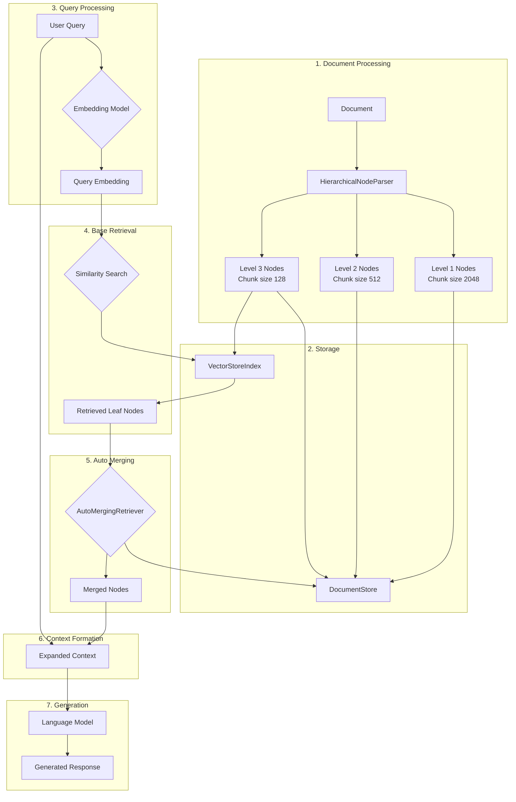

# Auto Merging Retriever Approach

## Introduction

The Auto Merging Retriever is an advanced implementation of the Retrieval-Augmented Generation (RAG) framework. This approach is designed to enhance the context-awareness and coherence of AI-generated responses by consolidating potentially disparate, smaller contexts into larger, more comprehensive contexts that can aid in synthesis.



### Motivation

Traditional RAG systems often struggle with maintaining coherence across larger contexts or when dealing with information that spans multiple chunks of text. The Auto Merging Retriever addresses this limitation by recursively merging subsets of leaf nodes that reference a parent node beyond a given threshold, allowing for a more comprehensive and coherent context during retrieval and generation.

### Method Details

#### Document Preprocessing and Hierarchy Creation

1. Document Loading: The input document (e.g., a PDF) is loaded and processed.
2. Hierarchical Parsing: The HierarchicalNodeParser is used to create a hierarchy of nodes from the document:
   - 1st level: chunk size 2048
   - 2nd level: chunk size 512
   - 3rd level: chunk size 128
3. Node Storage: All nodes are stored in a document store, with leaf nodes also indexed in a vector store.

#### Retrieval-Augmented Generation Workflow

1. Query Processing: The user query is embedded using the same embedding model used for document chunks.
2. Base Retrieval: A base retriever performs initial similarity search to find relevant leaf nodes.
3. Auto Merging: The AutoMergingRetriever looks at the set of retrieved leaf nodes and recursively "merges" subsets of leaf nodes that reference a parent node beyond a given threshold.
4. Context Formation: The merged nodes form an expanded context, which is combined with the original query.
5. Generation: The expanded context and query are passed to a large language model to generate a response.

### Key Features of Auto Merging Retriever

- Hierarchical Document Representation: Maintains a multi-level hierarchy of document chunks.
- Efficient Base Retrieval: Utilizes vector similarity search for fast and accurate initial information retrieval.
- Dynamic Context Expansion: Automatically merges relevant chunks into larger, more coherent contexts.
- Flexible Implementation: Can be used with various document types and language models.

### Benefits of this Approach

1. Improved Context Coherence: By merging related chunks, the system can provide more coherent and comprehensive contexts for the language model.
2. Adaptable Retrieval: The merging process adapts to the specific query and retrieved chunks, providing context-appropriate information.
3. Efficient Storage: Maintains a hierarchical structure while allowing for efficient base retrieval of leaf nodes.
4. Potential for Improved Response Quality: The expanded context may lead to more accurate and detailed responses from the language model.

### Evaluation Results

Evaluations comparing the Auto Merging Retriever to a base retriever showed:
- Similar performance in correctness, relevancy, faithfulness, and semantic similarity metrics.
- A slight preference (52.5%) for Auto Merging Retriever responses in pairwise comparisons.

These results suggest that the Auto Merging Retriever can provide comparable or slightly better performance compared to traditional retrieval methods.

### Conclusion

The Auto Merging Retriever offers a sophisticated approach to enhancing the retrieval process in RAG systems. By dynamically merging relevant chunks into larger contexts, it addresses some of the limitations of traditional chunk-based retrieval methods. While initial evaluations show promising results, further research and optimization may unlock more significant improvements in response quality and coherence.

### Prerequisites

To implement this system, you will need:

1. A large language model capable of text generation (e.g., GPT-3.5-turbo, GPT-4).
2. An embedding model for converting text chunks and queries into vector representations.
3. A vector database for efficient similarity search (e.g., FAISS).
4. A document store for maintaining the full hierarchy of nodes.
5. The LlamaIndex library, which provides implementations for HierarchicalNodeParser and AutoMergingRetriever.
6. Sufficient computational resources for processing and storing large document collections.
7. Programming knowledge in Python for implementation and evaluation.

### Usage

```python
from llama_index.core import StorageContext, VectorStoreIndex
from llama_index.core.node_parser import HierarchicalNodeParser
from llama_index.core.retrievers import AutoMergingRetriever

# Parse document into a hierarchy of nodes
node_parser = HierarchicalNodeParser.from_defaults()
nodes = node_parser.get_nodes_from_documents(docs)

# Set up storage
storage_context = StorageContext.from_defaults()
storage_context.docstore.add_documents(nodes)

# Create base index and retriever
leaf_nodes = get_leaf_nodes(nodes)
base_index = VectorStoreIndex(leaf_nodes, storage_context=storage_context)
base_retriever = base_index.as_retriever(similarity_top_k=6)

# Create AutoMergingRetriever
retriever = AutoMergingRetriever(base_retriever, storage_context, verbose=True)

# Use the retriever in a query engine
query_engine = RetrieverQueryEngine.from_args(retriever)
response = query_engine.query(query_str)
```

This README provides a comprehensive overview of the Auto Merging Retriever approach, its benefits, and basic usage instructions.