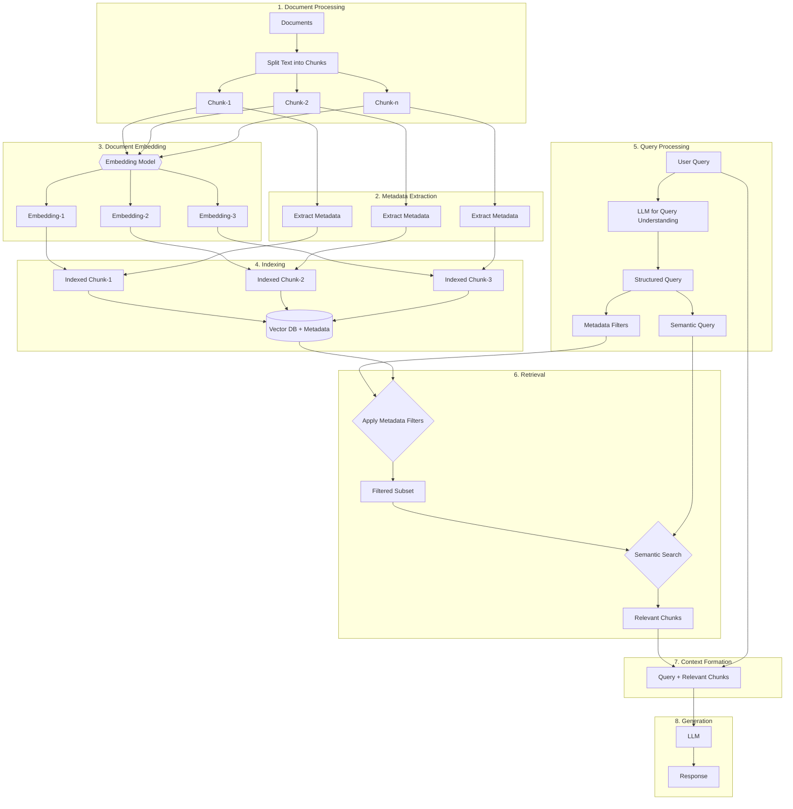

Certainly! Here's a README for the Self-Query RAG approach, which improves upon the base RAG by incorporating metadata extraction and intelligent query parsing:

# Self-Query RAG: Enhanced Retrieval-Augmented Generation with Metadata Filtering

## Introduction

Self-Query RAG is an advanced approach to Retrieval-Augmented Generation (RAG) that enhances the traditional RAG pipeline by incorporating metadata extraction during ingestion and intelligent query parsing during retrieval.

### Motivation

Traditional RAG systems often struggle with complex queries that involve both semantic similarity and specific metadata constraints. Self-Query RAG addresses these challenges by leveraging metadata and using an LLM to parse and structure user queries intelligently.

### Method Details

#### Document Preprocessing and Vector Store Creation

1. Documents are split into manageable chunks.
2. Metadata is extracted from each chunk (e.g., date, author, category).
3. Each chunk is embedded using a suitable embedding model.
4. Chunks, their embeddings, and associated metadata are indexed in a vector database.

#### Self-Query RAG Workflow

1. The user submits a natural language query.
2. An LLM parses the query to understand its intent and structure.
3. The LLM generates:
   a) Metadata filters based on the query.
   b) A semantic search query for relevant content.
4. Metadata filters are applied to narrow down the search space.
5. Semantic search is performed on the filtered subset.
6. Retrieved chunks are combined with the original query to form a context.
7. This context is passed to a Large Language Model (LLM) to generate a response.

### Key Features of Self-Query RAG

- Metadata Extraction: Enhances document representation with structured information.
- Intelligent Query Parsing: Uses an LLM to understand complex user queries.
- Hybrid Retrieval: Combines metadata filtering with semantic search.
- Flexible Querying: Allows users to implicitly specify metadata constraints in natural language.

### Benefits of this Approach

1. Improved Retrieval Accuracy: Metadata filtering helps to narrow down the search space to more relevant documents.
2. Handling Complex Queries: Can interpret and respond to queries that involve both content similarity and metadata constraints.
3. Efficient Retrieval: Metadata filtering can significantly reduce the number of documents that need to be semantically searched.
4. Enhanced Context: Metadata provides additional structured information to improve response generation.

### Conclusion

Self-Query RAG enhances the traditional RAG pipeline by incorporating metadata extraction and intelligent query parsing. This approach allows for more precise and efficient retrieval, especially for complex queries that involve both semantic similarity and specific metadata constraints. By leveraging the power of LLMs for query understanding, Self-Query RAG can provide more accurate and contextually relevant responses in AI-powered question-answering systems.