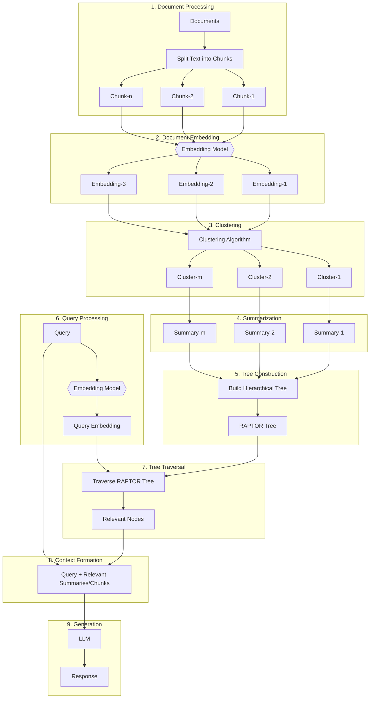

# RAPTOR: Recursive Abstractive Processing for Tree Organized Retrieval

## Introduction

RAPTOR (Recursive Abstractive Processing for Tree Organized Retrieval) is an advanced approach to Retrieval-Augmented Generation (RAG) that enhances the traditional RAG pipeline by incorporating hierarchical document structuring and summarization.

### Motivation

Traditional RAG systems often struggle with large document sets and complex queries. RAPTOR addresses these challenges by creating a hierarchical representation of the document corpus, allowing for more nuanced and efficient retrieval.

### Method Details

#### Document Preprocessing and Vector Store Creation

1. Documents are split into manageable chunks.
2. Each chunk is embedded using a suitable embedding model.
3. Embeddings are clustered to group similar content.
4. Clusters are summarized to create higher-level abstractions.
5. A hierarchical tree structure (RAPTOR Tree) is built using these summaries and original chunks.

#### Retrieval-Augmented Generation Workflow

1. The user query is embedded using the same embedding model.
2. The RAPTOR Tree is traversed to find relevant nodes (summaries or chunks).
3. Relevant content is combined with the original query to form a context.
4. This context is passed to a Large Language Model (LLM) to generate a response.

### Key Features of RAPTOR

- Hierarchical Document Representation: Creates a tree structure of document content.
- Multi-level Summarization: Provides abstractions at various levels of detail.
- Efficient Retrieval: Utilizes tree traversal for faster and more relevant information retrieval.
- Scalability: Better handles large document sets compared to flat vector stores.

### Benefits of this Approach

1. Improved Context Relevance: The hierarchical structure allows for more nuanced matching of queries to relevant content.
2. Efficient Retrieval: Tree traversal can be more efficient than exhaustive search in large vector spaces.
3. Handling Complex Queries: The multi-level structure is better equipped to handle queries that require information from multiple parts of the corpus.
4. Scalability: Can handle larger document sets more effectively than traditional RAG approaches.

### Conclusion

RAPTOR enhances the RAG pipeline by introducing a hierarchical, summary-based approach to document representation and retrieval. This method promises to improve the quality and efficiency of information retrieval, especially for large and complex document sets, leading to more accurate and contextually relevant responses in AI-powered question-answering systems.