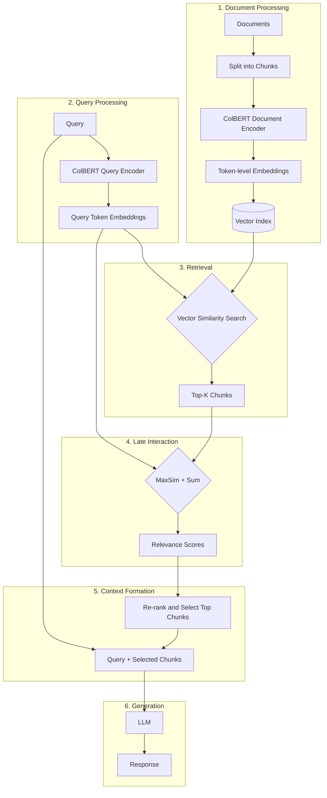
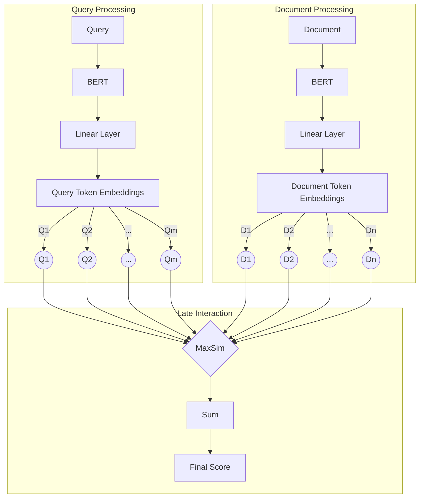

ColBERT (Contextualized Late Interaction over BERT) is indeed different from traditional dense embedding models. Here's a brief explanation of how ColBERT works:

1. Token-level embeddings: Instead of creating a single vector for an entire document or query, ColBERT creates embeddings for each token.

2. Late interaction: The similarity between a query and a document is computed by comparing each query token embedding with each document token embedding, rather than comparing single vectors.

3. MaxSim operation: For each query token, ColBERT finds the maximum similarity with any document token. These maximum similarities are then summed to get the final relevance score.

Now, let me create diagrams to illustrate this process within a RAG pipeline.

This diagram shows the overall ColBERT-based RAG pipeline, emphasizing the token-level processing and late interaction that are key to ColBERT's approach.

Now, let's create a more detailed diagram focusing on ColBERT's token-level embedding and late interaction mechanism:

This diagram illustrates:
1. How documents and queries are processed into token-level embeddings using BERT and a linear layer.
2. The late interaction mechanism where each query token is compared with each document token.
3. The MaxSim operation followed by summation to produce the final relevance score.

These diagrams more accurately represent how ColBERT works within a RAG pipeline, emphasizing its token-level approach and late interaction mechanism. This approach allows ColBERT to maintain more fine-grained information from both queries and documents, enabling more nuanced matching and potentially better retrieval performance compared to traditional dense embedding models.