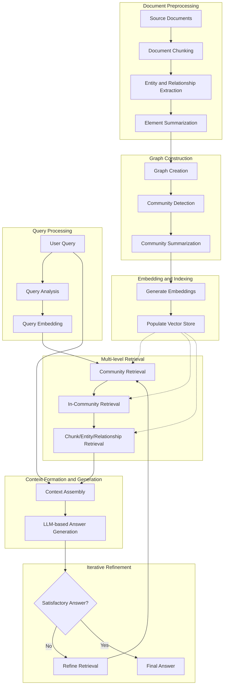

# GraphRAG: Enhancing Retrieval Augmented Generation with Graph-based Approaches

## Introduction

GraphRAG (Graph-based Retrieval Augmented Generation) is an advanced approach to information retrieval and generation that combines the strengths of graph-based data structures with the power of large language models (LLMs). This method aims to overcome limitations of traditional RAG systems by incorporating relational information and hierarchical structures into the retrieval and generation process.

### Motivation

While traditional RAG systems excel at retrieving relevant information for specific queries, they often struggle with:
1. Understanding complex relationships between different pieces of information
2. Handling queries that require a broader context or thematic understanding
3. Efficiently processing and retrieving information from large, diverse datasets

GraphRAG addresses these challenges by leveraging graph structures to represent and navigate information, enabling more nuanced and context-aware responses to user queries.

### Method Details

#### Document Preprocessing and Vector Store Creation

1. **Document Ingestion**: Source documents are processed and divided into smaller, manageable chunks.
2. **Entity and Relationship Extraction**: Each chunk is analyzed to identify entities and relationships between them.
3. **Element Summarization**: Extracted entities and relationships are summarized into descriptive text blocks.
4. **Graph Construction**: A graph is created using the entities as nodes and relationships as edges.
5. **Community Detection**: The graph is partitioned into communities using algorithms like Hierarchical Leiden.
6. **Community Summarization**: Each community is summarized to capture its main themes and content.
7. **Embedding Generation**: Embeddings are created for chunks, entities, relationships, and community summaries.
8. **Vector Store Population**: All embeddings are stored in a vector database for efficient retrieval.

#### Retrieval-Augmented Generation Workflow

1. **Query Analysis**: The user's query is analyzed to identify key entities and themes.
2. **Multi-level Retrieval**: 
   a. Relevant communities are retrieved based on the query.
   b. Within these communities, specific chunks, entities, and relationships are retrieved.
3. **Context Formation**: Retrieved information is assembled into a coherent context.
4. **Answer Generation**: The LLM generates an answer using the formed context and the original query.
5. **Iterative Refinement**: If needed, the system can perform multiple retrieval-generation cycles to refine the answer.

### Key Features of GraphRAG

1. **Hierarchical Information Representation**: Allows for both broad and specific information retrieval.
2. **Relational Context**: Captures and utilizes relationships between different pieces of information.
3. **Scalability**: Efficiently handles large and diverse datasets through community-based organization.
4. **Flexible Querying**: Supports both specific fact-finding and broader thematic inquiries.
5. **Explainable Retrieval**: The graph structure provides a clear path of how information was retrieved and connected.

### Benefits of this Approach

1. **Improved Context Understanding**: By leveraging graph structures, GraphRAG can provide more contextually relevant answers.
2. **Enhanced Thematic Awareness**: Community-based organization allows for better handling of broad, theme-based queries.
3. **Reduced Hallucination**: The structured approach to information retrieval helps in grounding the LLM's responses in factual data.
4. **Scalability**: Can efficiently handle larger and more diverse datasets compared to traditional RAG systems.
5. **Flexibility**: Adapts well to various types of queries, from specific fact-checking to open-ended exploration.

### Conclusion

GraphRAG represents a significant advancement in the field of retrieval-augmented generation. By integrating graph-based approaches with traditional RAG techniques, it offers a more nuanced, context-aware, and scalable solution for information retrieval and generation. This approach opens up new possibilities for building more intelligent and responsive AI systems capable of handling complex queries across large and diverse knowledge bases.