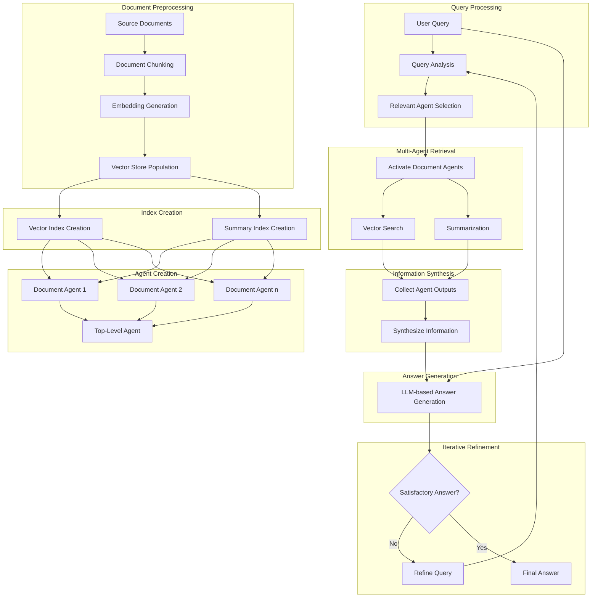

# Multi-Document Agentic RAG: Enhancing Retrieval Augmented Generation with Agent-Based Approaches

## Introduction

Multi-Document Agentic RAG (Retrieval Augmented Generation) is an advanced approach to information retrieval and generation that combines the strengths of multi-document processing, agent-based systems, and large language models (LLMs). This method aims to overcome limitations of traditional RAG systems by incorporating intelligent agents to handle complex queries across multiple documents.

### Motivation

While traditional RAG systems excel at retrieving relevant information from a single document, they often struggle with:
1. Handling queries that span multiple documents
2. Comparing and contrasting information from different sources
3. Providing context-aware responses that consider the relationships between documents
4. Efficiently processing and retrieving information from large, diverse datasets

Multi-Document Agentic RAG addresses these challenges by leveraging specialized document agents and a top-level orchestrating agent to provide more comprehensive and nuanced responses to user queries.

### Method Details

#### Document Preprocessing and Vector Store Creation

1. **Document Ingestion**: Source documents are processed and divided into smaller, manageable chunks.
2. **Embedding Generation**: Embeddings are created for each chunk of text.
3. **Vector Store Population**: Embeddings are stored in a vector database for efficient retrieval.
4. **Index Creation**: Both vector and summary indexes are created for each document.

#### Multi-Document Agentic RAG Workflow

1. **Document Agent Creation**: For each document, create a specialized agent with access to:
   a. A vector query engine for semantic search within the document
   b. A summary query engine for generating document summaries
2. **Top-Level Agent Setup**: Create a master agent that can access and coordinate all document agents.
3. **Query Processing**: The top-level agent analyzes the user's query to determine which document agents to involve.
4. **Multi-Agent Retrieval**: 
   a. Relevant document agents are activated based on the query.
   b. Each activated agent performs retrieval or summarization as needed.
5. **Information Synthesis**: The top-level agent collects and synthesizes information from the document agents.
6. **Answer Generation**: The LLM generates a comprehensive answer using the synthesized information and the original query.
7. **Iterative Refinement**: If needed, the system can perform multiple retrieval-generation cycles to refine the answer.

### Key Features of Multi-Document Agentic RAG

1. **Specialized Document Agents**: Each document has its own agent, allowing for focused and efficient retrieval.
2. **Hierarchical Agent Structure**: A top-level agent orchestrates the process, ensuring coherent multi-document reasoning.
3. **Flexible Querying**: Supports both specific fact-finding and broader thematic inquiries across multiple documents.
4. **Dynamic Tool Selection**: The top-level agent can choose the most appropriate tools (vector search or summarization) for each sub-query.
5. **Cross-Document Analysis**: Enables comparison and synthesis of information from multiple sources.

### Benefits of this Approach

1. **Improved Context Understanding**: By leveraging multiple document agents, the system can provide more contextually relevant answers that span multiple sources.
2. **Enhanced Comparative Analysis**: Enables easy comparison of information between different documents or topics.
3. **Scalability**: Can efficiently handle larger and more diverse datasets by distributing the workload across multiple agents.
4. **Flexibility**: Adapts well to various types of queries, from specific fact-checking to open-ended exploration across multiple documents.
5. **Reduced Hallucination**: The structured, multi-agent approach helps in grounding the LLM's responses in factual data from multiple sources.

### Conclusion

Multi-Document Agentic RAG represents a significant advancement in the field of retrieval-augmented generation. By integrating agent-based approaches with traditional RAG techniques, it offers a more nuanced, context-aware, and scalable solution for information retrieval and generation across multiple documents. This approach opens up new possibilities for building more intelligent and responsive AI systems capable of handling complex queries that span diverse knowledge bases.