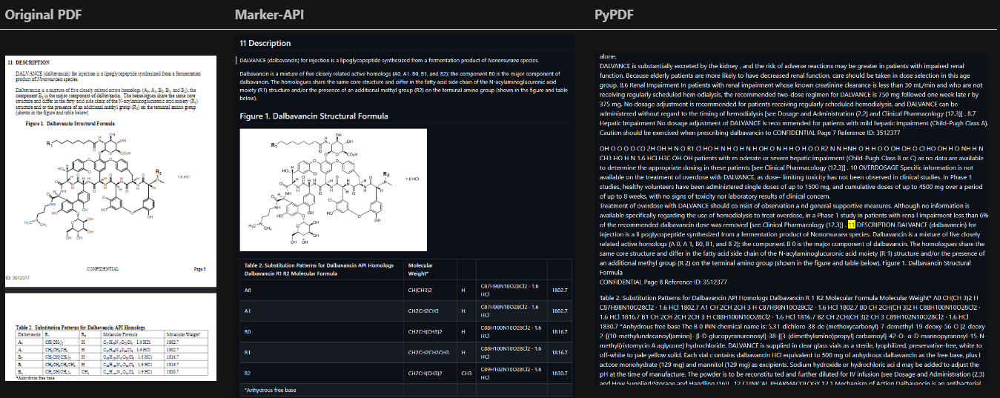

### RAG Comparison

In the landscape of modern information retrieval, the RAG (Retrieval Augmented Generation) approach has gained significant traction across industries. This project endeavors to provide an insightful comparative analysis of various RAG methodologies, shedding light on their respective strengths and limitations.

> [!IMPORTANT]
>
> ### Aim of the Comparison
>
> The aim of this comparison is to determine the most effective RAG (Retrieval Augmented Generation) pipeline and to identify which *category/stage* within the RAG pipeline has the greatest impact on the end result. While the current use case focuses on research papers and medical documents, this comparative study can be replicated across various other data sources, making the findings broadly applicable and highly valuable.

| Category/Factors               | Options                                                                 |
|------------------------|-------------------------------------------------------------------------|
| **Data**               | - 10 PDFs <br> - 100 PDFs <br> - 500 PDFs                               |
| **Data Processing**    | - PyPDF <br> - Marker-api <br> - PyMuPDF                                 |
| **RAG Techniques**     | - Naive RAG <br> - Hybrid RAG <br> - Sentence Window Retrieval <br> - Auto-merging Retrieval <br> - Agentic RAG <br> - Visual RAG <br> - Few more on the way |
| **Embedding Models**   | - text-embedding-ada-002 (API) <br> - bge-base-en-v1.5 (Open Source) <br> - nomic-embed-text-v1.5 (Open Source) |
| **Large Language Models (LLM)** | - OpenAI GPT-4o (API) <br> - LLama3 7b <br> - Phi 3 4b           |

## Metrics Used to Benchmark

- **RAG Metric**
  - Faithfulness
  - Answer Relevance
  - Context Precision
  - Context Relevancy
  - Context Recall
  - Context Entities Recall
- **Answer Metrics**
  - Semantic Similarity
  - Correctness
  - Aspect Critique
- **Performance Metrics**
  - First Token Latency
  - Retrieval Latency
  - Ingestion Time

## Approach

First, we started with 10 PDF, then expanded to 100 PDFs, and finally to 5000 pages to see how the different RAG approaches stack up against varying data scales. This is the highest level differentiator.

### Data Processing

As our data source mainly consisted of PDFs, we tried two approaches for text extraction: normal text extraction and using the Marker-api. The primary data source for this study comprises research papers and medical documents, typically available in PDF format. To facilitate seamless conversion to Markdown, we utilized the [Marker-api](https://github.com/adithya-s-k/marker-api), providing a straightforward API interface for PDF-to-Markdown conversion.

**Few Example Data Sources:**

- [Scientific Papers](https://huggingface.co/datasets/scientific_papers)

**Comparison between Original PDF, Marker API, PyPDF:**


Find the dataset we used for this comparison here: [Arxiv RAG Comparison](https://huggingface.co/datasets/AdithyaSK/Arxiv_RAG_Comparision) - [Download ZIP](https://huggingface.co/datasets/AdithyaSK/Arxiv_RAG_Comparision/resolve/main/Arxiv.zip?download=true)

We converted these PDFs to Markdown and ingested them into the RAG pipeline.

#### RAG Techniques Explored

1. **Naive RAG**
   - *Explanation*: The Naive RAG technique involves a straightforward approach to retrieval and generation, without extensive preprocessing or semantic analysis. It serves as a baseline for comparison against more sophisticated methods.
   - *Chunking Strategy*: used Character Level Chunking each chunk of size 1024 characters.
   Here is a visualization of the Naive RAG

   ```mermaid
   flowchart TD
    A[User Query] -->|Send Query| B[Retriever]
    B -->|Generate Query Embeddings| C[Query Embeddings]
    C -->|Calculate Similarity| D[(Vector Store)]
    D -->|Retrieve Relevant Documents| B
    B -->|Pass Relevant Documents| E[LLM]
    E -->|Generate Answer| F[Generated Answer]
    
    subgraph Data Preparation
        G[Data Source] -->|Raw Text Data| H[Character Level Chunking]
        H -->|Chunks of Text| I[Generate Embeddings]
        I -->|Embeddings| D[Vector Store]
    end
   ```

2. **Semantic Chunking RAG**
   - *Explanation*: Semantic Chunking RAG employs advanced semantic analysis techniques to break down text into meaningful chunks or segments. This method aims to improve relevance and coherence in retrieved information.

3. **Sentence Window Retrieval**
   - *Explanation*: Sentence Window Retrieval focuses on retrieving information based on contextual windows within a document. By considering the surrounding sentences, this technique aims to enhance the relevance of retrieved content.

4. **Auto-Merging Retrieval**
   - *Explanation*: Auto-Merging Retrieval leverages algorithms for automatically merging and synthesizing information from multiple sources. This approach aims to streamline the retrieval process and improve the quality of generated content.

5. **Agentic RAG**
   - *Explanation*: Agentic RAG introduces an agent-based approach to information retrieval and generation. Agents autonomously retrieve and process data, contributing to a more dynamic and adaptive system.

6. **Visual RAG**
   - *Explanation*: Visual RAG integrates visual information, such as images or diagrams, into the retrieval and generation process. By incorporating visual cues, this technique aims to enrich the content and improve user understanding.

#### Technology Stack

- **Orchestration Framework**: Leveraging the [Llama index](https://github.com/run-llama/llama_index) and [Langchain](https://github.com/langchain-ai/langchain)or seamless orchestration.
- **Embedding Generation**:
  - *Textual*: Utilizing [fastembed](https://github.com/qdrant/fastembed/) for textual embedding.
  - *Visual*: Employing CLIP for generating visual embeddings with [Hugginface pipeline](https://huggingface.co/docs/transformers/main/en/main_classes/pipelines#transformers.pipeline).
- **Language Model (LLM)**: Initial deployment utilizes OpenAI's LLM, with plans to extend compatibility to other open-source LLMs.
- **Evaluation Metrics**: Evaluation conducted using [RAGAS](https://github.com/explodinggradients/ragas).

#### Project Structure

- [**1_Naive_RAG.ipynb**](./1_Naive_RAG.ipynb)
- [**2_Hybrid_RAG.ipynb**](./2_Hybrid_RAG.ipynb)
- [**3_Sentence_Window_Retrieval_RAG.ipynb**](./3_Sentence_window_retrieval_RAG.ipynb)
- [**4_Auto_Merging_Retrieval_RAG.ipynb**](./4_Auto_merging_retrieval_RAG.ipynb)
- [**5_Agentic_RAG.ipynb**](./5_Agentic_RAG.ipynb)
- [**6_Visual_RAG.ipynb**](./6_Visual_RAG.ipynb)
- **assets/**
- **data/**: Repository for storing all data files, including PDF documents and Markdown files.

Through this structured approach, we aim to provide a comprehensive understanding of RAG methodologies, facilitating informed decision-making in their application across various domains.
