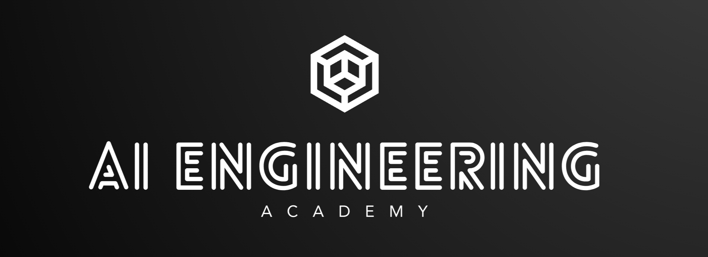

    <h1 ><a href="https://aiengineering.academy/" target="_blank">AIEngineering.academy</a></h1>
    
Navigating the World of AI, One Step at a Time

AI-related careers are becoming increasingly sought-after. However, the abundance of learning resources scattered across the internet can lead to confusion about where to start.&#x20;

**AI Engineering Academy** aims to provide a structured learning path to help you learn Applied AI effectively.

## Roadmaps

**AIEngineering.academy** offers multiple structured roadmaps to learn different domains in Applied GenAI.

### [**Retrieval Augmented Generation (RAG)**](broken-reference)

If you've been in the AI space, you might have heard of RAG (Retrieval Augmented Generation). In this roadmap, we will cover:

* Understanding what RAG is
* Implementing RAG from scratch without using any frameworks
* Choosing the best RAG system for your needs
* Taking a RAG system to production

### [**Fine-tuning**](broken-reference)

**(coming soon)**

We will debunk some myths about fine-tuning and explore where it can be effectively used. Fine-tuning can be a powerful tool, but it's often misunderstood. Expect to learn:

* The true potential of fine-tuning
* Proper techniques for fine-tuning models

### [**Deployment**](broken-reference)

**(coming soon)**

While everything might work perfectly locally, putting models into the hands of users requires careful consideration. In this roadmap, we will cover:

* Deploying ML and DL models into production
* Working with different cloud providers
* Exploring various deployment modes

Each roadmap is designed to provide a comprehensive learning experience, equipping you with the knowledge and skills to excel in applied GenAI.

### [Projects](./#projects)

**(coming soon)**

Consists on multiple Hands of End to End AI projects !!

  

