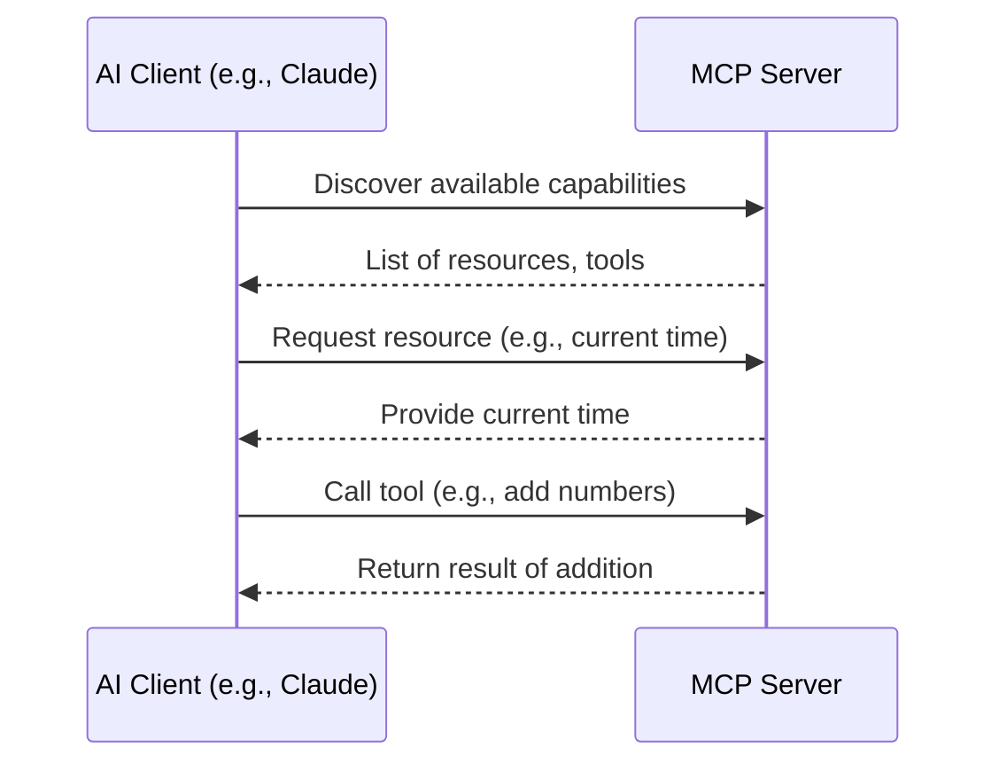
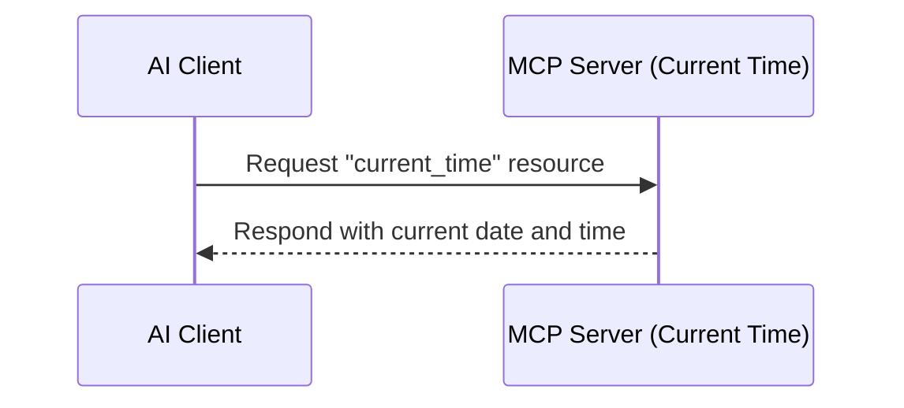
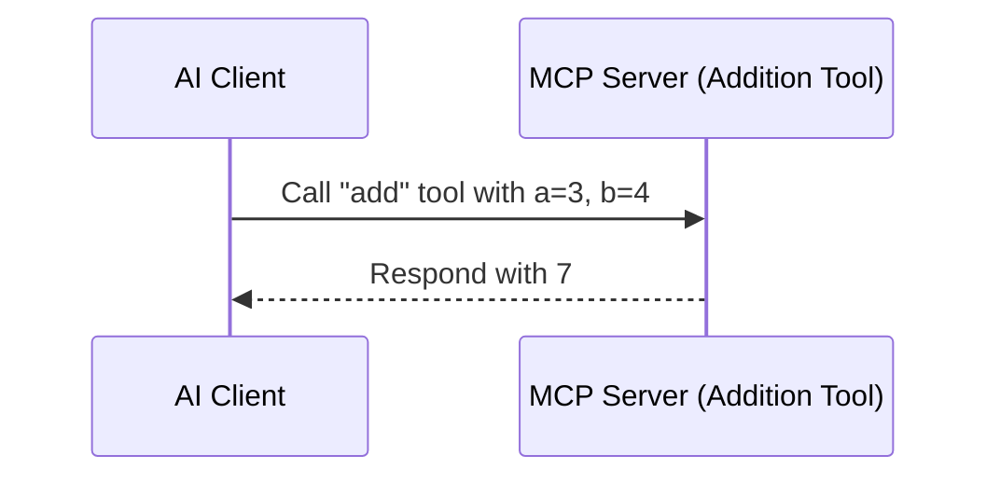
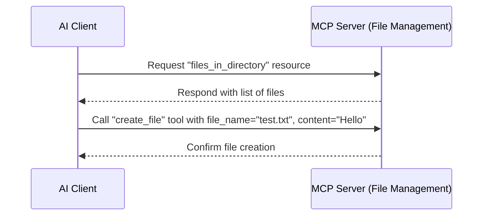

# Beginners Guide to creating an MCP server

---

### Introduction

The Model Context Protocol (MCP) is an open standard that helps AI applications, especially large language models (LLMs), connect with external data sources and tools. By creating your own MCP server in Python, you can tailor these connections to suit your specific needs, such as accessing custom databases or files. This guide will walk you through the process step by step, including a practical implementation from scratch.

### Installing the MCP Python SDK

First, you need to install the MCP Python SDK, which provides the tools to build your server. You can do this using pip:

```bash
pip install mcp

```

Alternatively, if you're using the `uv` tool (recommended for Claude Desktop), run:

```bash
uv add "mcp[cli]"

```

---

### Creating an MCP Server in Python: Step-by-Step Guide

To create an MCP server in Python, developers use the official Python SDK, available at [Model Context Protocol Python SDK](https://github.com/modelcontextprotocol/python-sdk). The SDK implements the full MCP specification, making it easy to build servers that expose resources, prompts, and tools. Here's a detailed guide:

1. **Installation**:
   - Install the SDK using `pip install mcp` or, for Claude Desktop, `uv add "mcp[cli]"`. The latter requires `uv`, which can be installed on macOS via `brew install uv`.
2. **Basic Server Creation**:

   - Use the `FastMCP` class for high-level implementation. Create a Python script, e.g., `server.py`, and define the server:

     ```python
     from mcp import FastMCP

     mcp = FastMCP("My First Server")

     ```

   - Add tools using `@mcp.tool()`, e.g.,:

     ```python
     @mcp.tool()
     def add(a: int, b: int) -> int:
         """Add two numbers"""
         return a + b

     ```

   - Add resources using `@mcp.resource()`, e.g.,:

     ```python
     @mcp.resource("greeting")
     def get_greeting(name: str) -> str:
         return f"Hello, {name}!"

     ```

3. **Running and Testing**:
   - For development, run `mcp dev server.py`. This mode supports testing with MCP Inspector, started via `mcp inspector`, allowing interaction with the server.
   - For Claude Desktop integration, install with `mcp install server.py`. This sets up the server to run when Claude Desktop launches, accessible in its MCP settings.
4. **Advanced Features**:

   - Specify dependencies in `FastMCP`, e.g., `mcp = FastMCP("My App", dependencies=["pandas", "numpy"])`. Install them in development with `mcp dev server.py --with pandas --with numpy`.
   - Define prompts using `@mcp.prompt()`, e.g.,:

     ```python
     @mcp.prompt()
     def review_code(code: str) -> str:
         return f"Please review this code:\\n\\n{code}"

     ```

   - For low-level control, use `Server("example-server")` with lifespan management, as shown in examples like Echo Server and SQLite Explorer in the SDK.

### Creating a Basic MCP Server

To create a server, you'll use the `FastMCP` class from the SDK. Here's how:

1. **Define the Server**: Create a Python script, say `server.py`, and import `FastMCP`. Give your server a name:

   ```python
   from mcp import FastMCP

   mcp = FastMCP("My First Server")

   ```

2. **Add Tools**: Tools are functions the LLM can call, defined with `@mcp.tool()`. For example, a tool to add two numbers:

   ```python
   @mcp.tool()
   def add(a: int, b: int) -> int:
       """Add two numbers"""
       return a + b

   ```

3. **Add Resources**: Resources provide data, defined with `@mcp.resource()`. For example, a greeting resource:

   ```python
   @mcp.resource("greeting")
   def get_greeting(name: str) -> str:
       return f"Hello, {name}!"

   ```

### Running and Testing the Server

- **Development Mode**: Run the server for testing with:

  ```bash
  mcp dev server.py

  ```

  You can test it using MCP Inspector, a tool for interacting with your server:

  ```bash
  mcp inspector

  ```

- **Claude Desktop Integration**: To use the server in Claude Desktop, install it with:

  ```bash
  mcp install server.py

  ```

  It will then be available in Claude Desktop for the LLM to use.

### Practical Implementation from Scratch

Let's build a server that gets the current time and lists files in a directory:

1. Create a file `time_and_files_server.py` with:

   ```python
   from mcp import FastMCP
   import datetime
   import os

   mcp = FastMCP("Time and Files Server")

   @mcp.tool()
   def get_current_time() -> str:
       """Get the current time in ISO format"""
       return datetime.datetime.now().isoformat()

   @mcp.resource("files_in_directory")
   def list_files(directory: str) -> list[str]:
       """List files in the specified directory"""
       return [file for file in os.listdir(directory) if os.path.isfile(os.path.join(directory, file))]

   ```

2. Run in development mode:

   ```bash
   mcp dev time_and_files_server.py

   ```

3. Test with MCP Inspector, then install for Claude Desktop:

   ```bash
   mcp install time_and_files_server.py

   ```

### More MCP Server Concept and Examples

Before diving into the examples, let’s look at how MCP servers work in general:



This diagram shows the basic flow: the AI client discovers what the server offers, then requests resources or calls tools as needed.

---

Below is a beginner-friendly guide to understanding MCP servers by building three hands-on examples. The Model Context Protocol (MCP) is an open standard that allows AI applications, like Claude or Cursor, to connect to external data sources and tools through a standardized interface. An MCP server is a service that provides these capabilities—such as data (resources) or actions (tools)—to an AI client. In this guide, we’ll create three simple MCP servers, each with code, explanations, and Mermaid workflow diagrams, plus an overall diagram for the MCP server concept.

### Example 1: Current Time Server (Resource)

This server provides a resource that returns the current date and time when requested.

### Code

```python
from mcp import FastMCP
import datetime

mcp = FastMCP("Current Time Server")

@mcp.resource("current_time")
def get_current_time() -> str:
    """Get the current date and time"""
    return datetime.datetime.now().isoformat()

if __name__ == "__main__":
    mcp.run()

```

### Workflow Diagram



### Explanation

- **What it does**: The server defines a resource called `"current_time"`.
- **How it works**: When the AI client requests this resource, the server runs the `get_current_time` function and returns the current date and time in ISO format (e.g., `"2023-10-25T14:30:00.123456"`).
- **Why it’s useful**: This shows how an MCP server can provide data to an AI, like real-time information.

---

### Example 2: Addition Server (Tool)

This server provides a tool that adds two numbers based on input from the client.

### Code

```python
from mcp import FastMCP

mcp = FastMCP("Addition Server")

@mcp.tool()
def add(a: int, b: int) -> int:
    """Add two numbers"""
    return a + b

if __name__ == "__main__":
    mcp.run()

```

### Workflow Diagram



### Explanation

- **What it does**: The server defines a tool called `"add"` that takes two integers (`a` and `b`) and returns their sum.
- **How it works**: The client sends a request to use the `"add"` tool with parameters (e.g., `a=3, b=4`), and the server computes and returns the result (`7`).
- **Why it’s useful**: This demonstrates how an MCP server can perform actions for the AI, extending its capabilities beyond just providing data.

---

### Example 3: File Management Server (Resource and Tool)

This server combines a resource (listing files) and a tool (creating a file) in a temporary directory, showing how multiple capabilities can work together.

### Code

```python
from mcp import FastMCP
import os
import tempfile

temp_dir = tempfile.mkdtemp()
print(f"Using temporary directory: {temp_dir}")

mcp = FastMCP("File Management Server")

@mcp.resource("files_in_directory")
def list_files() -> list[str]:
    """List files in the temporary directory"""
    return [file for file in os.listdir(temp_dir) if os.path.isfile(os.path.join(temp_dir, file))]

@mcp.tool()
def create_file(file_name: str, content: str) -> str:
    """Create a new file with the given content in the temporary directory"""
    file_path = os.path.join(temp_dir, file_name)
    with open(file_path, "w") as f:
        f.write(content)
    return f"File '{file_name}' created in temporary directory"

if __name__ == "__main__":
    mcp.run()

```

### Workflow Diagram



### Explanation

- **What it does**:
  - The `"files_in_directory"` resource returns a list of files in a temporary directory.
  - The `"create_file"` tool creates a new file with specified content in that directory.
- **How it works**:
  - The client can request the file list (e.g., initially empty `[]`).
  - The client can then call `"create_file"` with parameters (e.g., `file_name="test.txt", content="Hello"`), and the server creates the file and confirms it.
- **Why it’s useful**: This shows how an MCP server can combine data retrieval and actions, making it more versatile for AI applications.

---

### Testing Your Servers

To try these servers yourself:

1.  **Save the Code**: Save each script as a `.py` file (e.g., `current_time_server.py`, `addition_server.py`, `file_management_server.py`).
2.  **Run the Server**: Open a terminal and start the server in development mode:

    ```bash
    mcp dev current_time_server.py

    ```

3.  **Interact with It**: In another terminal, use the MCP Inspector:
    Follow the prompts to request resources (e.g., `"current_time"`) or call tools (e.g., `"add"` with `a=3, b=4`).
    ```bash
    mcp inspector

        ```

The inspector lets you see what the server offers and test its capabilities.

This example shows how to create a server with both tools and resources, enhancing your AI's capabilities.

---

### Survey Note: Comprehensive Guide to Creating an MCP Server in Python with Practical Implementation

This section provides a detailed exploration of creating a Model Context Protocol (MCP) server using Python, including practical implementation from scratch. The analysis is based on recent online resources, reflecting the state as of February 25, 2025, and aims to offer a professional, thorough overview for developers interested in AI integration.

### Understanding MCP and Its Relevance

MCP, or Model Context Protocol, is an open protocol designed to standardize how applications provide context to large language models (LLMs). It acts as a universal interface, likened to a USB-C port for AI, enabling seamless connections to data sources and tools. Introduced by Anthropic, PBC, on November 24, 2024, MCP addresses the challenge of AI models being isolated from data, trapped behind information silos and legacy systems, as noted in [Introducing the Model Context Protocol | Anthropic](https://www.anthropic.com/news/model-context-protocol). Its development was motivated by the need for a universal standard to replace fragmented, custom implementations, allowing developers to build smarter, scalable AI systems.

The protocol operates on a client-server architecture, where MCP hosts (e.g., Claude Desktop, IDEs) connect to MCP servers that expose specific capabilities. These servers can provide prompts, resources, and tools, as outlined in [Specification – Model Context Protocol Specification](https://spec.modelcontextprotocol.io/specification/). This standardization is crucial for breaking down data silos, enhancing scalability, and ensuring security, though its adoption is still evolving, with some debate around support for remote hosts, currently in active development, as mentioned in [For Server Developers - Model Context Protocol](https://modelcontextprotocol.io/quickstart/server).

### Examples and Community Contributions

The SDK includes examples like Echo Server and SQLite Explorer, available at [Model Context Protocol Python SDK](https://github.com/modelcontextprotocol/python-sdk/tree/main/examples). Community servers, such as [code-executor](https://github.com/bazinga012/mcp_code_executor) for Python code execution and [mcp-alchemy](https://github.com/runekaagaard/mcp-alchemy) for database access, provide further inspiration. These servers, listed in [Awesome MCP Servers](https://github.com/punkpeye/awesome-mcp-servers), show real-world applications, though some, like FastMCP by jlowin, are no longer maintained, as noted in [GitHub - jlowin/fastmcp](https://github.com/jlowin/fastmcp).

### Challenges and Considerations

While creating an MCP server is straightforward, challenges include ensuring security, especially for remote hosts, which are still in development. The protocol's adoption is evolving, with some controversy around compatibility and support across platforms. Developers should refer to [For Server Developers - Model Context Protocol](https://modelcontextprotocol.io/quickstart/server) for best practices and contribute to discussions at [GitHub Discussions](https://github.com/modelcontextprotocol/python-sdk/discussions).

### Conclusion

Creating an MCP server in Python using the official SDK is accessible, with `FastMCP` simplifying the process. The practical implementation of a time and file listing server illustrates its potential, while community examples offer avenues for further exploration. As MCP adoption grows, developers can contribute to its ecosystem, enhancing AI integration and breaking data silos.

### Key Citations

- [Introducing the Model Context Protocol | Anthropic](https://www.anthropic.com/news/model-context-protocol)
- [Specification – Model Context Protocol Specification](https://spec.modelcontextprotocol.io/specification/)
- [For Server Developers - Model Context Protocol](https://modelcontextprotocol.io/quickstart/server)
- [Model Context Protocol Python SDK](https://github.com/modelcontextprotocol/python-sdk)
- [Awesome MCP Servers](https://github.com/punkpeye/awesome-mcp-servers)
- [GitHub - jlowin/fastmcp](https://github.com/jlowin/fastmcp)
- [code-executor MCP Server](https://github.com/bazinga012/mcp_code_executor)
- [mcp-alchemy MCP Server](https://github.com/runekaagaard/mcp-alchemy)
- [GitHub Discussions for Python SDK](https://github.com/modelcontextprotocol/python-sdk/discussions)
