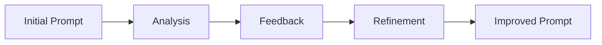

# Advanced Prompting Techniques: A Comprehensive Guide

Advanced prompt engineering techniques represent the cutting edge of AI interaction, going beyond basic prompting to achieve more sophisticated reasoning and specialized outcomes. This guide will walk you through these advanced methods, explaining how they work and how to use them effectively.

## Table of Contents

1. [Chain of Thought (CoT)](#chain-of-thought)
2. [Self-Consistency](#self-consistency)
3. [ReAct Prompting](#react-prompting)
4. [Multimodal Prompting](#multimodal-prompting)
5. [Real-Time Optimization](#real-time-optimization)
6. [Active Prompting](#active-prompting)
7. [Generated Knowledge](#generated-knowledge)
8. [Directional-Stimulus](#directional-stimulus)

---

## Chain of Thought

Chain-of-Thought (CoT) prompting is a sophisticated technique that enhances an AI model's ability to handle complex reasoning tasks. Think of it as showing your work in a math problem – instead of just providing the final answer, you demonstrate each step of your thinking process.

### Understanding CoT

When we use Chain-of-Thought prompting, we're asking the AI to break down complex problems into smaller, more manageable steps. This approach leads to more accurate and logical outputs because it forces the model to "think" through each stage of the solution.

### Practical Example

```
Problem: A store has a 30% discount on all items. If Sarah buys a shirt
originally priced at $40 and pants originally priced at $60, how much
does she save in total?

Chain of Thought:
1. Calculate original total:
   Shirt ($40) + Pants ($60) = $100

2. Calculate discount percentage:
   30% of $100 = $100 × 0.30 = $30

Therefore, Sarah saves $30 in total.
```

### Advanced Usage: CoT Rollouts

CoT rollouts take this concept further by generating multiple reasoning paths for a given problem. Here's what makes them powerful:

1. **Self-consistency decoding**

   - Generate multiple solution paths
   - Compare the different approaches
   - Choose the most commonly reached conclusion

2. **Complexity-based evaluation**

   - Assess the depth of each reasoning chain
   - Consider the thoroughness of each approach
   - Select solutions with comprehensive reasoning

3. **Human validation integration**
   - Use human expertise when rollouts disagree
   - Validate critical decision points
   - Refine the reasoning process

---

## Self-Consistency

Self-consistency is an enhancement to Chain-of-Thought prompting that focuses on generating and evaluating multiple reasoning paths. This approach is particularly valuable when dealing with problems that have various valid solution methods.

### Key Components

The self-consistency approach involves:

1. Generating multiple independent solutions
2. Analyzing the consistency between different approaches
3. Identifying patterns in reasoning
4. Selecting the most reliable outcome

### Example Implementation

```
Question: Calculate 15% of 240

Path 1:
- 10% of 240 = 24
- 5% is half of 10% = 12
- Total: 24 + 12 = 36

Path 2:
- Convert 15% to decimal: 0.15
- Multiply: 240 × 0.15 = 36

Path 3:
- Break down into: (240 × 10/100) + (240 × 5/100)
- = 24 + 12
- = 36

All paths converge on 36, indicating high confidence in the answer.
```

---

## ReAct Prompting

ReAct (Reasoning and Acting) prompting is a synergistic approach that combines reasoning traces with specific actions. This technique allows AI models to dynamically plan, execute, and adjust their approach during complex problem-solving scenarios.

### Core Components

The ReAct framework consists of three main elements:

1. **Thought**: The model's internal reasoning process
2. **Action**: Specific tasks or queries to be performed
3. **Observation**: Results or information gathered from actions

### Comprehensive Example

```
Task: Find out who directed the highest-grossing film of 2009

1. Thought: I need to identify the highest-grossing film of 2009 first
2. Action: Search for "highest-grossing film 2009"
3. Observation: Avatar was the highest-grossing film of 2009

4. Thought: Now I need to find out who directed Avatar
5. Action: Search for "Avatar 2009 director"
6. Observation: James Cameron directed Avatar

7. Thought: I have all the necessary information
8. Answer: James Cameron directed Avatar, the highest-grossing film of 2009
```

### Applications

ReAct prompting excels in:

- Complex question answering
- Multi-step task automation
- Interactive information gathering
- Decision-making processes
- External knowledge base interaction

---

## Multimodal Prompting

Multimodal prompt engineering involves crafting prompts that work with multiple types of input data. This technique enables more comprehensive and context-aware AI interactions by combining different forms of information.

### Input Types and Handling

- **Text**: Written instructions, questions, or content
- **Images**: Visual data, diagrams, or pictures
- **Audio**: Sound files, speech, or music
- **Video**: Moving images, animations, or recordings

### Best Practices

When working with multiple modalities:

1. Provide clear instructions for each input type
2. Establish relationships between different inputs
3. Specify desired output formats
4. Maintain context across all modalities

---

## Real-Time Optimization

Real-time prompt optimization is an emerging technology that provides instant feedback on prompt effectiveness. This dynamic approach helps refine prompts for better outcomes.

### Key Aspects

The system evaluates:

- Prompt clarity and specificity
- Potential biases in instructions
- Alignment with desired outcomes
- Response quality and relevance

### Optimization Process



---

## Active Prompting

Active prompting allows for dynamic adjustment of prompts based on user interaction and feedback. This adaptive approach enables AI models to refine their responses in real-time throughout an interaction.

### Process Flow

The active prompting cycle involves:

1. Initial prompt delivery
2. User response analysis
3. Prompt adjustment
4. Refined response generation
5. Continuous improvement

---

## Generated Knowledge

Generated Knowledge Prompting enhances AI responses by first generating relevant knowledge before answering questions. This two-step approach improves the model's common sense reasoning and contextual understanding.

### Implementation Steps

1. **Knowledge Generation Phase**

   - Generate relevant facts and context
   - Identify key concepts
   - Establish relationships between ideas

2. **Knowledge Integration Phase**
   - Incorporate generated knowledge
   - Formulate comprehensive response
   - Ensure contextual accuracy

### Benefits

- Improved response accuracy
- Enhanced contextual understanding
- Better-grounded answers
- More informative outputs

---

## Directional-Stimulus Prompting

Directional-Stimulus Prompting (DSP) is an innovative framework that uses a small, tunable policy model to generate auxiliary prompts that guide larger language models toward desired outputs.

### Technical Details

The DSP approach includes:

- Utilization of smaller policy models (like T5)
- Supervised fine-tuning processes
- Reinforcement learning optimization
- Performance monitoring and adjustment

### Notable Results

- Achieved 41.4% improvement in ChatGPT's performance on MultiWOZ dataset
- Required only 80 dialogues for significant improvements
- Demonstrated flexibility across various tasks

---

## Implementation Guidelines

### For Beginners

1. Start with basic CoT prompting
2. Practice with simple, well-defined problems
3. Gradually incorporate more advanced techniques
4. Document successful patterns and approaches

### For Advanced Users

1. Combine multiple techniques strategically
2. Develop custom implementations for specific use cases
3. Optimize performance through systematic testing
4. Contribute to methodology advancement

### Universal Best Practices

1. Always start with clear objectives
2. Test thoroughly before deployment
3. Monitor and measure results
4. Iterate based on performance data

Remember: The most effective technique for your situation depends on your specific needs and constraints. Start simple and add complexity only when necessary.

---

## Chain-of-Thought

Chain-of-thought (CoT) rollouts are an advanced prompt engineering technique that enhances the reasoning capabilities of large language models. This method involves generating multiple reasoning paths for a given problem and selecting the most consistent or comprehensive solution. By performing several CoT rollouts, prompt engineers can improve the model's ability to tackle complex tasks requiring logical thinking and multi-step problem-solving.

### Key Aspects of CoT Rollouts

- **Self-consistency decoding**: Choosing the most commonly reached conclusion among multiple rollouts.
- **Complexity-based prompting**: Selecting rollouts with the longest chains of thought.
- **Human intervention**: Consulting a person to correct the chain of thought if rollouts significantly disagree.
- **Improved accuracy**: Enhancing the model's performance on tasks involving reasoning, calculation, and decision-making.

By leveraging CoT rollouts, prompt engineers can create more robust and reliable AI systems capable of handling intricate problems across various domains.

---

## ReAct Prompting Illustrated

ReAct (Reasoning and Acting) prompting is an advanced technique that combines reasoning traces and task-specific actions to enhance the problem-solving capabilities of large language models (LLMs). This approach allows LLMs to generate verbal reasoning steps and perform actions in an interleaved manner, leading to more effective and dynamic problem-solving.

### A Typical ReAct Prompt

1. **Thought**: The model's reasoning process.
2. **Action**: A specific task or query to be performed.
3. **Observation**: The result or information obtained from the action.

#### Example

**Question**: What is the capital of the country where the Eiffel Tower is located?

1. **Thought**: To answer this question, I need to find out where the Eiffel Tower is located and then determine the capital of that country.
2. **Action**: Search for "Location of Eiffel Tower."
3. **Observation**: The Eiffel Tower is located in Paris, France.
4. **Thought**: Now that I know the Eiffel Tower is in France, I need to find out the capital of France.
5. **Action**: Search for "Capital of France."
6. **Observation**: The capital of France is Paris.
7. **Thought**: I have all the information needed to answer the question.
8. **Action**: Provide answer.
9. **Answer**: The capital of the country where the Eiffel Tower is located is Paris, France.

### Applications of ReAct Prompting

- **Question Answering**: Enhancing the model's ability to break down complex questions and gather relevant information.
- **Task Automation**: Guiding models through multi-step processes by combining reasoning and action.
- **Interacting with External Knowledge Bases**: Allowing models to retrieve and incorporate additional information to support their reasoning.
- **Decision-Making**: Improving the model's capacity to evaluate options and make informed choices based on available data.

By implementing ReAct prompting, developers and researchers can create more robust and adaptable AI systems capable of handling complex reasoning tasks and real-world problem-solving scenarios.

---

## Directional-Stimulus Prompting

Directional Stimulus Prompting (DSP) is an innovative framework designed to guide large language models (LLMs) towards specific desired outputs. This technique employs a small, tunable policy model to generate auxiliary directional stimulus prompts for each input instance, acting as nuanced hints to steer LLMs in generating desired outcomes.

### Key Features of DSP

- Utilization of a small, tunable policy model (e.g., T5) to generate directional stimuli.
- Optimization through supervised fine-tuning and reinforcement learning.
- Applicability to various tasks, including summarization, dialogue response generation, and chain-of-thought reasoning.
- Significant performance improvements with minimal labeled data, such as a 41.4% boost in ChatGPT's performance on the MultiWOZ dataset using only 80 dialogues.

By leveraging DSP, researchers and practitioners can enhance the capabilities of black-box LLMs without directly modifying their parameters, offering a flexible and efficient approach to prompt engineering.

---

## Generated Knowledge Prompting

Generated Knowledge Prompting is a technique that enhances AI model performance by first asking the model to generate relevant facts before answering a question or completing a task. This two-step process involves knowledge generation, where the model produces pertinent information, followed by knowledge integration, where this information is used to formulate a more accurate and contextually grounded response.

### Key Benefits

- Improved accuracy and reliability of AI-generated content.
- Enhanced contextual understanding of the given topic.
- Ability to anchor responses in factual information.
- Potential for combining with external sources like APIs or databases for further knowledge augmentation.

By prompting the model to first consider relevant facts, Generated Knowledge Prompting helps create more informative and well-reasoned outputs, particularly useful for complex tasks or when dealing with specialized subject matter.
