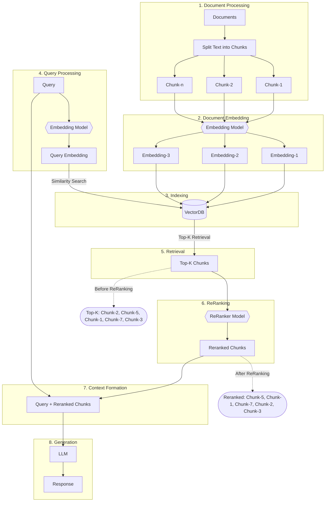

Re Ranker

```mermaid
flowchart TD
    subgraph "1. Document Processing"
        A[Documents] --> B[Split Text into Chunks]
        B --> C1[Chunk-1]
        B --> C2[Chunk-2]
        B --> C3[Chunk-n]
    end
    
    subgraph "2. Document Embedding"
        EM1{{Embedding Model}}
        C1 & C2 & C3 --> EM1
        EM1 --> D1[Embedding-1] & D2[Embedding-2] & D3[Embedding-3]
    end
    
    subgraph "3. Indexing"
        D1 & D2 & D3 --> E[(VectorDB)]
    end
    
    subgraph "4. Query Processing"
        F[Query] --> EM2{{Embedding Model}}
        EM2 --> G[Query Embedding]
    end
    
    subgraph "5. Retrieval"
        G -->|Similarity Search| E
        E -->|Top-K Retrieval| H[Top-K Chunks]
    end
    
    subgraph "6. ReRanking"
        H --> RR{{ReRanker Model}}
        RR --> I[Reranked Chunks]
    end
    
    subgraph "7. Context Formation"
        I --> J[Query + Reranked Chunks]
    end
    
    subgraph "8. Generation"
        J --> K[LLM]
        K --> L[Response]
    end
    
    F --> J

    %% Highlighting the difference between Top-K and Reranked chunks
    H -.-> |Before ReRanking|M([Top-K: Chunk-2, Chunk-5, Chunk-1, Chunk-7, Chunk-3])
    I -.-> |After ReRanking|N([Reranked: Chunk-5, Chunk-1, Chunk-7, Chunk-2, Chunk-3])

```
