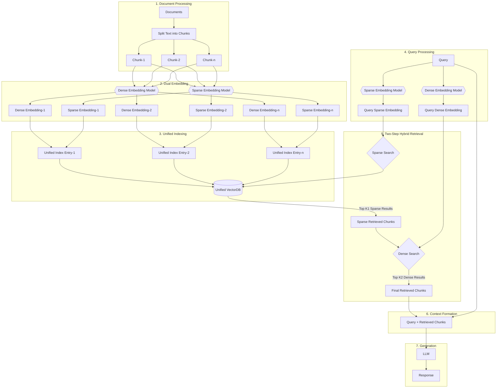
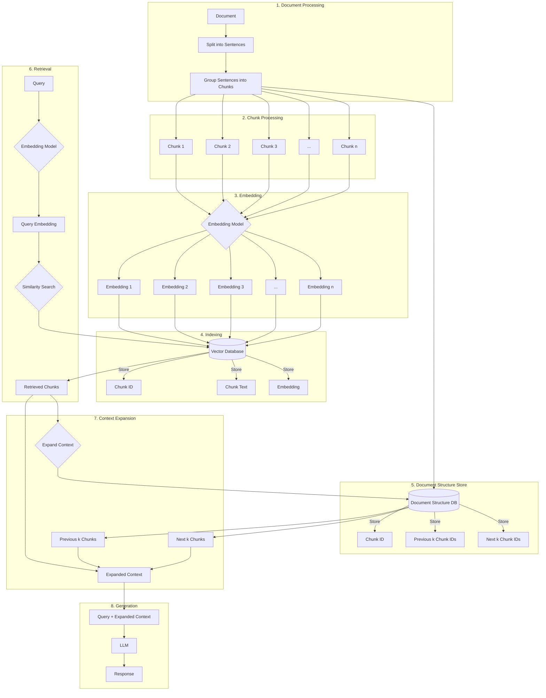

# Sentence Window Retriever-Based RAG Approach

## Introduction

The Sentence Window Retriever-Based RAG (Retrieval-Augmented Generation) approach is an advanced implementation of the RAG framework, designed to enhance the context-awareness and coherence of AI-generated responses. This method combines the power of large language models with efficient information retrieval techniques, providing a robust solution for generating high-quality, context-rich responses.

### Motivation

Traditional RAG systems often struggle with maintaining coherence across larger contexts or when dealing with information that spans multiple chunks of text. The Sentence Window Retriever-Based approach addresses this limitation by preserving the contextual relationships between chunks during the indexing process and leveraging this information during retrieval and generation.

### Method Details

#### Document Preprocessing and Vector Store Creation

1. Document Splitting: The input document is split into sentences.
2. Chunk Creation: Sentences are grouped into manageable chunks.
3. Embedding: Each chunk is processed through an embedding model to create vector representations.
4. Vector Database Indexing: Chunk IDs, text, and embeddings are stored in a vector database for efficient similarity search.
5. Document Structure Indexing: A separate database stores the relationships between chunks, including references to previous and next k chunks for each chunk.

#### Retrieval-Augmented Generation Workflow

1. Query Processing: The user query is embedded using the same embedding model used for chunks.
2. Similarity Search: The query embedding is used to find the most relevant chunks in the vector database.
3. Context Expansion: For each retrieved chunk, the system fetches the previous and next k chunks using the document structure database.
4. Context Formation: The retrieved chunks and their expanded context are combined with the original query.
5. Generation: The expanded context and query are passed to a large language model to generate a response.

### Flow Chart

The following flow chart illustrates the Sentence Window Retriever-Based RAG approach:

### Key Features of RAG

- Efficient Retrieval: Utilizes vector similarity search for fast and accurate information retrieval.
- Context Preservation: Maintains document structure and chunk relationships during indexing.
- Flexible Context Window: Allows for adjustable context expansion at retrieval time.
- Scalability: Capable of handling large document collections and diverse query types.

### Benefits of this Approach

1. Improved Coherence: By including surrounding chunks, the system can generate more coherent and contextually accurate responses.
2. Reduced Hallucination: Access to expanded context helps the model ground its responses in retrieved information, reducing the likelihood of generating false or irrelevant content.
3. Efficient Storage: Only stores necessary information in the vector database, optimizing storage usage.
4. Adaptable Context: The size of the context window can be adjusted based on the specific needs of different queries or applications.
5. Preservation of Document Structure: Maintains the original structure and flow of the document, allowing for more nuanced understanding and generation.

### Conclusion

The Sentence Window Retriever-Based RAG approach offers a powerful solution for enhancing the quality and contextual relevance of AI-generated responses. By preserving document structure and allowing for flexible context expansion, this method addresses key limitations of traditional RAG systems. It provides a robust framework for building advanced question-answering, document analysis, and content generation applications.

