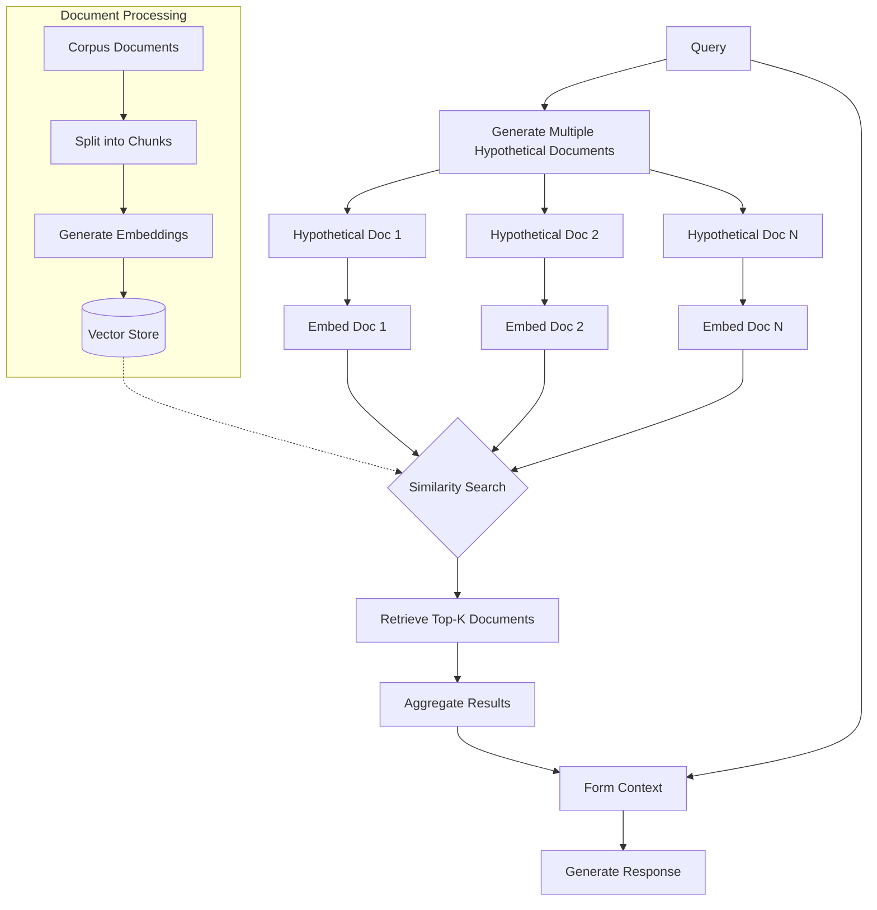

## Introduction

This project implements a Retrieval-Augmented Generation (RAG) system enhanced with Hypothetical Document Embeddings (HyDE), a novel approach to dense retrieval that improves the accuracy and relevance of retrieved information.

### Motivation

Traditional RAG systems often struggle with semantic understanding of complex queries. HyDE addresses this by generating a hypothetical answer, which serves as a more informative representation of the query intent, leading to more accurate document retrieval.

### Method Details

#### Document Preprocessing and Vector Store Creation

1. Split documents into manageable chunks
2. Generate embeddings for each chunk using a suitable embedding model
3. Store embeddings in a vector database for efficient similarity search

#### Retrieval-Augmented Generation Workflow

1. Query Processing:
   - Generate a hypothetical document/answer to the query using an LLM
2. Document Embedding:
   - Create an embedding of the hypothetical document
3. Similarity Search:
   - Compare the hypothetical document embedding against the corpus embeddings
4. Retrieval:
   - Fetch the top-K most similar real documents
5. Context Formation:
   - Combine the original query with the retrieved documents
6. Generation:
   - Use an LLM to generate the final response based on the formed context

### Key Features of RAG with HyDE

- Hypothetical document generation for improved query understanding
- Dense retrieval using document-to-document similarity
- Integration with existing RAG pipelines
- Flexible architecture allowing for different embedding and language models

### Benefits of this Approach

- Enhanced semantic understanding of complex queries
- Improved retrieval accuracy, especially for nuanced or abstract questions
- Reduced sensitivity to specific query phrasing
- Better handling of out-of-distribution queries

### Conclusion

The HyDE-enhanced RAG system represents a significant advancement in information retrieval and question-answering technologies. By leveraging hypothetical documents, it bridges the gap between user queries and relevant information, resulting in more accurate and contextually appropriate responses.

