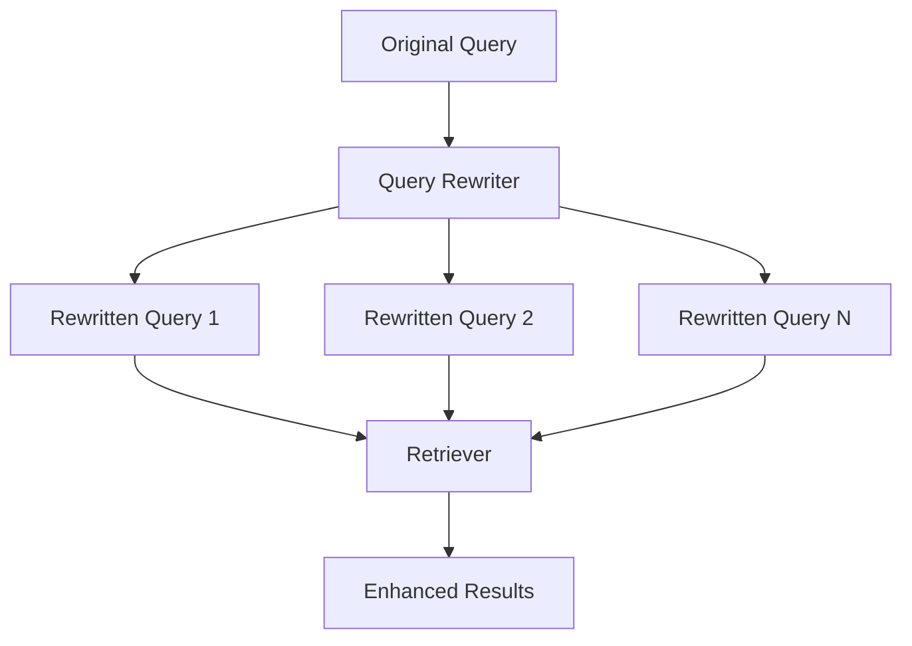
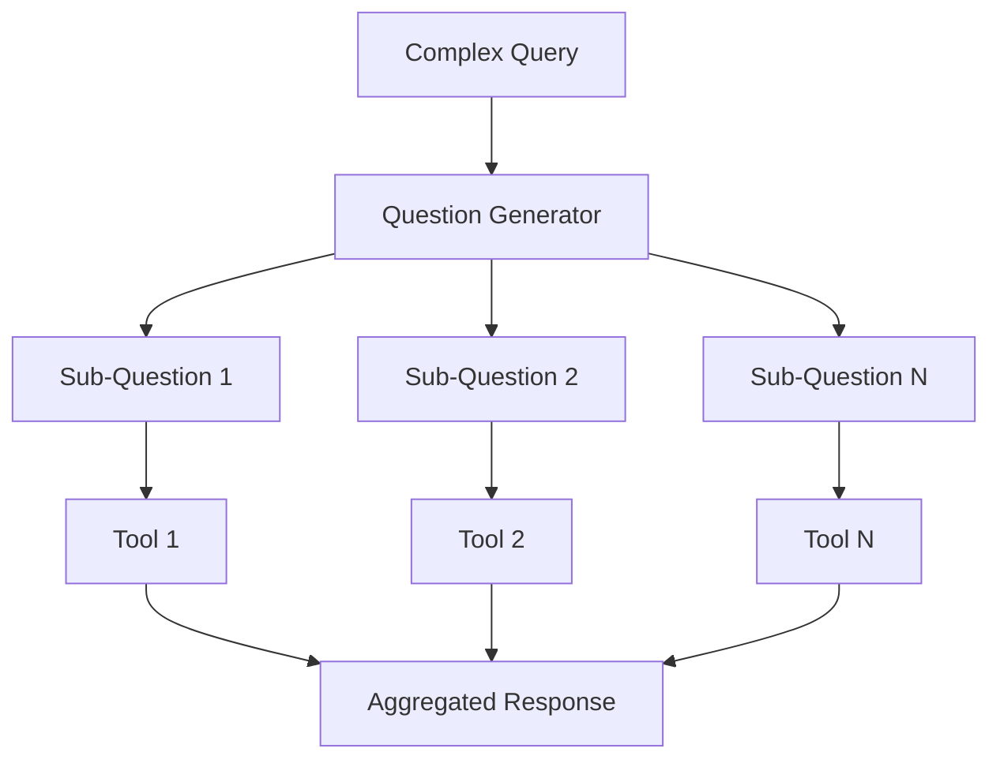
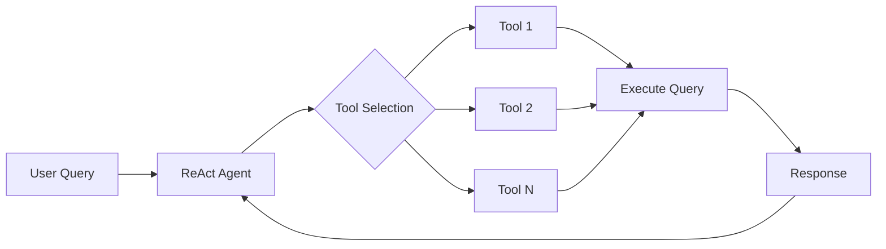

# Query Transform Cookbook

## Introduction

The Query Transform Cookbook demonstrates various techniques for transforming and decomposing user queries before execution in a Retrieval-Augmented Generation (RAG) query engine, agent, or other pipeline. These transformations can enhance the quality and relevance of responses in AI applications.

## Query Transformation Techniques

### 1. Routing

Routing involves identifying the relevant subset of tools that apply to a given query.

<antArtifact identifier="routing-diagram" type="application/vnd.ant.mermaid" title="Routing Diagram">
flowchart LR
    A[User Query] --> B[Selector]
    B --> C[Tool 1]
    B --> D[Tool 2]
    B --> E[Tool N]
    C & D & E --> F[Selected Tools]


#### Implementation:
- Use `LLMSingleSelector` or `LLMMultiSelector` for LLM-based selection
- Use `PydanticSingleSelector` or `PydanticMultiSelector` for function calling-based selection
- Define tool choices using `ToolMetadata`

### 2. Query Rewriting

Query rewriting involves generating multiple variations of the original query to improve retrieval results.



#### Implementation:
- Custom implementation using `PromptTemplate` and LLM
- Use `HyDEQueryTransform` for hypothetical document embeddings

### 3. Sub-Questions Generation

This technique decomposes a complex query into multiple sub-questions, each targeted at specific tools.



#### Implementation:
- Use `OpenAIQuestionGenerator` or `LLMQuestionGenerator`
- Define tool choices using `ToolMetadata`

### 4. ReAct Agent Tool Picking

This approach uses the ReAct framework to decide both the tool to use and the query to execute on that tool.



#### Implementation:
- Use `ReActChatFormatter` for input formatting
- Use `ReActOutputParser` for parsing LLM output
- Define tools using `FunctionTool`

## Usage

Each query transformation technique can be used as a modular component in larger systems. Here's a basic usage example for query rewriting:

```python
from llama_index.core import PromptTemplate
from llama_index.llms.openai import OpenAI

query_gen_prompt = PromptTemplate("Your prompt template here")
llm = OpenAI(model="gpt-3.5-turbo")

def generate_queries(query: str, llm, num_queries: int = 4):
    response = llm.predict(query_gen_prompt, num_queries=num_queries, query=query)
    queries = response.split("\n")
    return queries

queries = generate_queries("Your query here", llm)
```

## Conclusion

The Query Transform Cookbook provides a comprehensive set of techniques for enhancing query processing in AI applications. By leveraging these transformations, developers can create more robust and accurate information retrieval and question-answering systems.

For more detailed implementations and integrations with specific query engines or retrievers, refer to the LlamaIndex documentation.
</antArtifact>

This README provides an overview of the Query Transform Cookbook, including brief explanations and Mermaid diagrams for each of the four main query transformation techniques: Routing, Query Rewriting, Sub-Questions Generation, and ReAct Agent Tool Picking.

Each section includes a diagram visualizing the process, a brief description of the technique, and basic implementation details. The README also includes a simple usage example for query rewriting to give users a starting point.

Is there any specific part of this README you'd like me to expand on or modify?