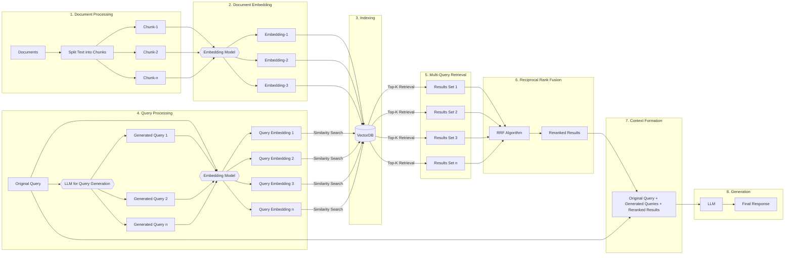

# RAG-Fusion: Enhanced Retrieval-Augmented Generation

## Introduction

RAG-Fusion is an advanced approach to information retrieval and text generation that builds upon the foundation of Retrieval-Augmented Generation (RAG). This project implements RAG-Fusion to provide more accurate, contextually relevant, and comprehensive responses to user queries.

### Motivation

Traditional RAG systems, while effective, often face limitations in capturing the full scope of user intent and retrieving the most relevant information. RAG-Fusion addresses these challenges by:

1. Generating multiple queries to capture different aspects of the user's intent
2. Utilizing advanced reranking techniques to improve retrieval accuracy
3. Providing a more nuanced context for the language model to generate responses

### Method Details

#### Document Preprocessing and Vector Store Creation

1. **Text Chunking**: Documents are split into manageable chunks.
2. **Embedding Generation**: Each chunk is converted into a vector representation using a pre-trained embedding model.
3. **Indexing**: The embeddings are stored in a vector database for efficient retrieval.

#### Retrieval-Augmented Generation Workflow

1. **Query Expansion**: The original user query is expanded into multiple related queries using a language model.
2. **Multi-Query Embedding**: All queries (original and generated) are embedded.
3. **Vector Search**: Each query embedding is used to retrieve relevant document chunks from the vector store.
4. **Reciprocal Rank Fusion (RRF)**: Results from multiple queries are combined and reranked using the RRF algorithm.
5. **Context Formation**: The original query, generated queries, and reranked results form the context.
6. **Response Generation**: A large language model generates the final response based on the enriched context.

### Key Features of RAG-Fusion

- Multi-query generation for comprehensive intent capture
- Reciprocal Rank Fusion for improved result relevance
- Integration of multiple information retrieval techniques
- Flexible architecture supporting various embedding models and language models

### Benefits of this Approach

1. **Enhanced Query Understanding**: By generating multiple queries, RAG-Fusion captures a broader range of potential user intents.
2. **Improved Retrieval Accuracy**: The use of RRF helps surface the most relevant information across multiple query results.
3. **Reduced Hallucination**: By providing more comprehensive and accurate context, the chances of model hallucination are reduced.
4. **Versatility**: The system can be applied to various domains and types of queries.
5. **Scalability**: The architecture allows for easy scaling to handle large document collections.

### Conclusion

RAG-Fusion represents a significant advancement in the field of information retrieval and text generation. By addressing the limitations of traditional RAG systems, it offers a more robust, accurate, and versatile solution for a wide range of applications, from question-answering systems to document summarization tasks.
